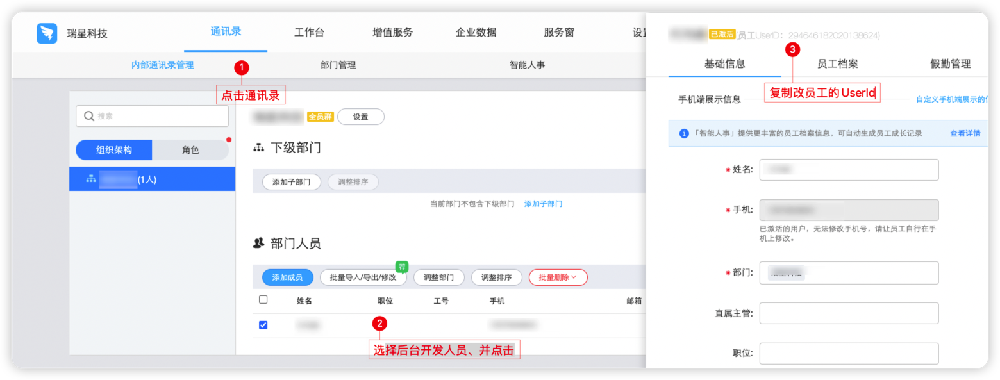
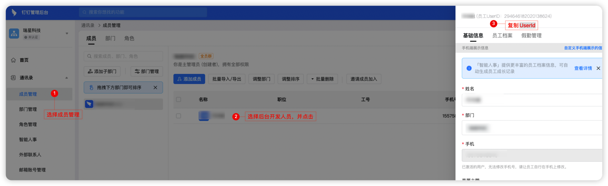
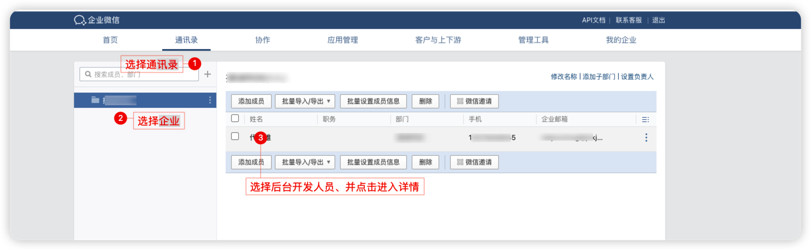
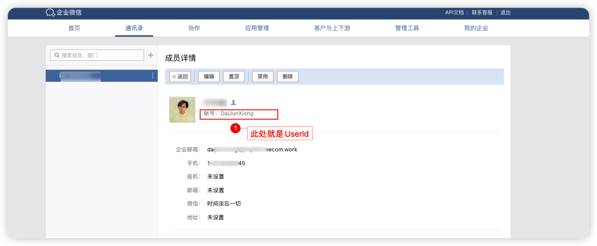

## :pig_nose:前言

:question:为何要开发这个starter?

本项目是受到公司上线后的一天，人肉监控后台日志，故而产生的一个想法，监控错误发送到钉钉/企业微信群

#### 开源地址

[Gitee](https://gitee.com/djxchi/notice-spring-boot-starter) [Github](https://github.com/djx1314520/notice-spring-boot-starter) 如果本项目能解决您一些难题，请给我一个免费的start吧:kissing_heart:

#### :eyes: 功能列表

1、可以配合注解从而达到接口谁写的就会在群里艾特谁。<br/>
2、提供项目管理角色，如果配置，则会在发送和处理异常的时候都会艾特项目管理人员<br/>
3、提供异常列表，会存储对应的请求参数和请求头数据（请求头需要自行配置需要保存的）<br/>
4、提供异常详情页面，类似于控制台数据错误堆栈<br/>
5、可以处理异常，处理时，需要填写<br/>

#### :eyes: 功能脑图


#### 四步快速集成 :tada:

##### 1、引入依赖 [查看最新的依赖](https://search.maven.org/artifact/club.bigtian/notice-spring-boot-starter)

```xml
<dependency>
  <groupId>club.bigtian</groupId>
  <artifactId>notice-spring-boot-starter</artifactId>
  <version>最新的版本号</version>
</dependency>
```

##### 2、执行sql文件，可以在源码的docs下载sql文件

```sql
create table t_exception_info
(
    id           bigint auto_increment
        primary key,
    url          varchar(100)            not null comment '请求url',
    content      longtext                not null comment '异常信息堆栈',
    create_time  datetime                null comment '创建时间',
    handled      varchar(10) default 'N' null comment '是否已处理（N:未处理，Y已处理）',
    handled_time datetime                null comment '处理时间',
    handled_man  varchar(20)             null comment '处理人',
    cause        text                    null comment '导致原因',
    params       longtext                null comment '请求参数',
    headers      text                    null comment '请求头'
)
    comment '异常信息';
```

###### 3、配置spring boot的yaml文件

```yaml
notice:
  dingtalk: #如果是配置钉钉消息推送，则需要配置加密和token
    secret:  #目前只支持群机器人为加密方式
    token:  #机器人token
  envs: #配置该项是为了在钉钉群中区分异常属于那个环境
    dev: 开发环境 #默认第一个为开发环境
    test: 测试环境
    prod: 正式环境
  project-name: 演示系统 #项目名称
  enterprise-we-chat: #如果配置企业微信发送
    key: #企业微信webhook key
  headers: #需要存放到数据库中的请求头数据
    - authorization
  managers: DaiJunXiong #配置需要发送的userId，钉钉和企业微信有区别，获取方式请往下看
  developers:
    bigtian: DaiJunXiong #后台开发者别名与钉钉/企业微信userId关联起来，方便单独艾特
  exclude-exception:  #需要排除的异常，排除的异常不再进行消息推送
  excludePacket: #需要排除的异常包路径，属于改包下面的所有异常都不会再进行异常消息推送
  title: 异常信息提醒 #异常提醒的标题，默认是（异常信息提醒）
  successTitle: 异常处理提醒 #异常被处理的标题，默认是（异常处理提醒）
  atAll: false #是否艾特全体成员（只有发送消息为钉钉的时候有效），默认为false，配置为true后，产生异常和处理异常都是艾特全体成员
  timeout: 5 #默认同一个接口5s内不会再次发送相同的消息通知
```

###### 4、配置mybatis/mybatis plus xml扫描路径`classpath*:/mappers/**/*.xml`

```yaml
mybatis:
  mapper-locations: 你们的mapper路径,classpath*:/mappers/**/*.xml
```


## 获取钉钉UserId [钉钉企业后台](https://oa.dingtalk.com/contacts.htm#/contacts?_k=4aj78i)

##### 1、旧版获取方式



##### 2、新版获取方式



## 获取企业微信UserId [企业微信后台](https://work.weixin.qq.com/wework_admin/frame#contacts)

##### 



`企业微信一般默认的UserId都是名称的大写驼峰，当然账号是可以修改的，具体还得以详情页面为准`


#### 自行扩展

1、扩展通知方式可以实现`INoticeService`类重写它的两个方法

```java
/**
 * @author bigtian
 * @Description: 消息通知
 * @date 2022/9/1210:38
 */
public interface INoticeService {

    /**
     * 发送系统异常消息
     *
     * @param info
     * @param list
     * @author bigtian
     * @since 6.0
     */
    void sendMessage(TExceptionInfo info, List<String> list);

    /**
     * 发送异常处理消息
     *
     * @param info
     * @author bigtian
     * @since 6.0
     */
    void sendHandledMessage(TExceptionInfo info);
}
```

2、扩展某一段时间内，同一个接口只能通知一次，可以实现`ISystemCacheService`类重写它的两个方法

```java
/**
 * isystem缓存服务
 * @author bigtian
 * @date 2022/09/12
 */
public interface ISystemCacheService {


    /**
     * 是否在配置的时间内
     * @return
     * @author bigtian
     * @since 6.0
     */
    boolean expirationTime();

    /**
     * 加入到缓存
     * @author bigtian
     * @since 6.0
     */
    String  putVal();
}

```

3、获取请求路径可以使用静态方法`RequestUtils.getRequestPath()`

## 反馈交流


## :question:FAQ

> 1、为什么不用手机号作为钉钉/企业微信配置而是用UserId？

`1、为了保证员工的隐私问题，手机号属于敏感信息，并不是所有人都能接受`

`2、如果开发离职可以不留下手机号，更好的保证员工的隐私`
