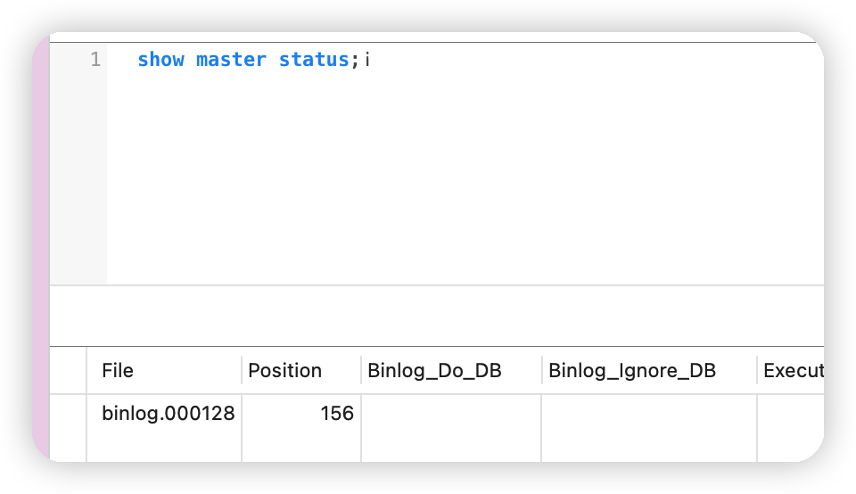

# Canal

## 1、Canal简介
主要用途是基于 MySQL 数据库增量日志解析，提供增量数据订阅和消费


基于日志增量订阅和消费的业务包括

- 数据库镜像
- 数据库实时备份
- 索引构建和实时维护(拆分异构索引、倒排索引等)
- 业务 cache 刷新
- 带业务逻辑的增量数据处理

### 1.1、工作原理

#### 1.2、MySQL主备复制原理


- MySQL master 将数据变更写入二进制日志( binary log, 其中记录叫做二进制日志事件binary log events，可以通过 show binlog events 进行查看)
- MySQL slave 将 master 的 binary log events 拷贝到它的中继日志(relay log)
- MySQL slave 重放 relay log 中事件，将数据变更反映它自己的数据

### 1.1.2、Canal 工作原理

- canal 模拟 MySQL slave 的交互协议，伪装自己为 MySQL slave ，向 MySQL master 发送dump 协议
- MySQL master 收到 dump 请求，开始推送 binary log 给 slave (即 canal )
- canal 解析 binary log 对象(原始为 byte 流)

## 2、Mysql配置

### 2.1、开启主从复制

以docker容器为例

修改挂载出来的my.cnf配置文件，添加如下内容

```sh
log-bin=/var/lib/mysql/mysql-bin
binlog-do-db=park
server-id=123
```

配置解读：

- `log-bin=/var/lib/mysql/mysql-bin`：设置binary log文件的存放地址和文件名，叫做mysql-bin
- `binlog-do-db=park`：指定对哪个database记录binary log events，这里记录park这个库
- `server-id=123`:这个是master在传输binlog日志的同时会把`server-id`一同传给salve，如有多个slave需保证唯一

最终效果

```sh {10-12}
[mysqld]

datadir=/var/lib/mysql
socket=/var/lib/mysql/mysql.sock
secure-file-priv=/var/lib/mysql-files
user=mysql

pid-file=/var/run/mysqld/mysqld.pid

log-bin=/var/lib/mysql/mysql-bin
server-id=12345
binlog-do-db=park
```

### 2.2、设置用户权限

接下来添加一个仅用于数据同步的账户，出于安全考虑，这里仅提供对park这个库的操作权限。

```mysql
create user canal@'%' IDENTIFIED by 'canal';
GRANT SELECT, REPLICATION SLAVE, REPLICATION CLIENT,SUPER ON *.* TO 'canal'@'%' identified by 'canal';
FLUSH PRIVILEGES;
```

重启mysql容器即可

```
docker restart mysql
```

测试设置是否成功：在mysql控制台，或者Navicat中，输入命令：

```
show master status;
```



## 3、安装Canal

### 3.1、创建Docker网络

把MQ、Canal、Mysql放到同一个网络中

`docker network create 网络名`

如容器在运行中可使用`docker network connect  网络名 容器名`加入到同一网络

### 3.2、安装Canal

#### 3.3、复制Canal配置文件到本地

以docker容器为例，分两步走

1. 首先把canal的默认配置文件拷贝到本地
2. 把canal的文件挂载出来

```ini
docker run -p 11111:11111 --name canals \
-e canal.destinations=bigtian \
-e canal.instance.master.address=mysql:3306  \
-e canal.instance.dbUsername=canal  \
-e canal.instance.dbPassword=canal  \
-e canal.instance.connectionCharset=UTF-8 \
-e canal.instance.tsdb.enable=true \
-e canal.instance.gtidon=false  \
--network bigtian \
-d canal/canal-server:v1.1.6
```

> 参数解析：

- `-p 11111:11111`：这是canal的默认监听端口

- `-e canal.instance.master.address=mysql:3306`：数据库地址和端口，如果不知道mysql容器地址，可以通过`docker inspect 容器id`来查看

- `-e canal.instance.dbUsername=canal`：数据库用户名

- `-e canal.instance.dbPassword=canal` ：数据库密码

  

`docker cp canals:/home/admin/canal-server/conf ./`拷贝到本地后，可以删除当前容器

### 3.4、修改默认配置文件

修改`canal.destinations`定义的文件下的 `instance.properties`

```properties

canal.instance.gtidon=false

# position info
canal.instance.master.address=127.0.0.1:3306
canal.instance.master.journal.name=
canal.instance.master.position=
canal.instance.master.timestamp=
canal.instance.master.gtid=

# rds oss binlog
canal.instance.rds.accesskey=
canal.instance.rds.secretkey=
canal.instance.rds.instanceId=

# table meta tsdb info
canal.instance.tsdb.enable=true


# username/password
canal.instance.dbUsername=canal
canal.instance.dbPassword=canal
canal.instance.connectionCharset = UTF-8

canal.instance.enableDruid=false

# 默认是所有库下面的所有表
canal.instance.filter.regex=.*\\..*
# table black regex
canal.instance.filter.black.regex=mysql\\.slave_.*


canal.mq.topic=example

canal.mq.partition=0


```

`canal.instance.filter.regex`配置规则

```sh
mysql 数据解析关注的表，Perl正则表达式.
多个正则之间以逗号(,)分隔，转义符需要双斜杠(\\) 
常见例子：
1.  所有表：.*   or  .*\\..*
2.  canal schema下所有表： canal\\..*
3.  canal下的以canal打头的表：canal\\.canal.*
4.  canal schema下的一张表：canal.test1
5.  多个规则组合使用然后以逗号隔开：canal\\..*,mysql.test1,mysql.test2 
```

### 3.2.3、启动Canal

```sh
docker run -p 11111:11111 --name canals \
-e canal.destinations=bigtian \
-e canal.instance.master.address=mysql:3306  \
-e canal.instance.dbUsername=canal  \
-e canal.instance.dbPassword=canal  \
-e canal.instance.connectionCharset=UTF-8 \
-e canal.instance.tsdb.enable=true \
-e canal.instance.gtidon=false  \
-v 复制出来的配置路径:/home/admin/canal-server/conf \
-v /Users/daijunxiong/docker/canal/logs:/home/admin/canal-server/logs \
--network bigtian \
-d canal/canal-server:v1.1.6
```

## 4、Spring boot 整合Canal

> 引入依赖，maven中央仓库最新的是1.2.1

::: warning 警告
但是1.2.1不支持数据库下划线命名转驼峰，建议去作者的最新代码`1.2.6`自行打包，该版本解决了命名问题 [github地址](https://github.com/NormanGyllenhaal/canal-client.git)
:::

```xml
<dependency>
  <groupId>top.javatool</groupId>
  <artifactId>canal-spring-boot-starter</artifactId>
  <version>1.2.1-RELEASE</version>
</dependency>
```


> 编写表的映射类


```java
@Data
public class Bigtian {
    private String id;
    private String name;
}
```

> 编写Canal消息处理类

```java
@Slf4j
@Component
@CanalTable("bigtian")
public class BigtianHandler implements EntryHandler<Bigtian> {
    @Override
    public void insert(Bigtian bigtian) {
        System.out.println("新建");
        System.out.println(bigtian);
    }

    @Override
    public void update(Bigtian before, Bigtian after) {
        System.out.println("修改前");
        System.out.println(before);
        System.out.println("修改后");
        System.out.println(after);
    }

    @Override
    public void delete(Bigtian bigtian) {
        System.out.println("删除");
        System.out.println(bigtian);
    }

}
```
