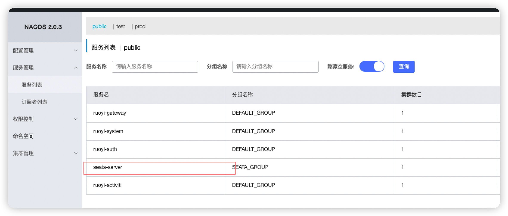

# Seata

## seata模式及原理介绍

Seata 是一款开源的分布式事务解决方案，致力于提供高性能和简单易用的分布式事务服务。Seata 将为用户提供了 AT、TCC、SAGA 和 XA 事务模式，为用户打造一站式的分布式解决方案。 

### AT 模式

### 前提

- 基于支持本地 ACID 事务的关系型数据库。
- Java 应用，通过 JDBC 访问数据库。

### 整体机制

两阶段提交协议的演变：

- 一阶段：业务数据和回滚日志记录在同一个本地事务中提交，释放本地锁和连接资源。
- 二阶段：
  - 提交异步化，非常快速地完成。
  - 回滚通过一阶段的回滚日志进行反向补偿。

### 写隔离

- 一阶段本地事务提交前，需要确保先拿到 **全局锁** 。
- 拿不到 **全局锁** ，不能提交本地事务。
- 拿 **全局锁** 的尝试被限制在一定范围内，超出范围将放弃，并回滚本地事务，释放本地锁。

以一个示例来说明：

两个全局事务 tx1 和 tx2，分别对 a 表的 m 字段进行更新操作，m 的初始值 1000。

tx1 先开始，开启本地事务，拿到本地锁，更新操作 m = 1000 - 100 = 900。本地事务提交前，先拿到该记录的 **全局锁** ，本地提交释放本地锁。 tx2 后开始，开启本地事务，拿到本地锁，更新操作 m = 900 - 100 = 800。本地事务提交前，尝试拿该记录的 **全局锁** ，tx1 全局提交前，该记录的全局锁被 tx1 持有，tx2 需要重试等待 **全局锁** 。


tx1 二阶段全局提交，释放 **全局锁** 。tx2 拿到 **全局锁** 提交本地事务。


如果 tx1 的二阶段全局回滚，则 tx1 需要重新获取该数据的本地锁，进行反向补偿的更新操作，实现分支的回滚。

此时，如果 tx2 仍在等待该数据的 **全局锁**，同时持有本地锁，则 tx1 的分支回滚会失败。分支的回滚会一直重试，直到 tx2 的 **全局锁** 等锁超时，放弃 **全局锁** 并回滚本地事务释放本地锁，tx1 的分支回滚最终成功。

因为整个过程 **全局锁** 在 tx1 结束前一直是被 tx1 持有的，所以不会发生 **脏写** 的问题。

### 读隔离

在数据库本地事务隔离级别 **读已提交（Read Committed）** 或以上的基础上，Seata（AT 模式）的默认全局隔离级别是 **读未提交（Read Uncommitted）** 。

如果应用在特定场景下，必需要求全局的 **读已提交** ，目前 Seata 的方式是通过 SELECT FOR UPDATE 语句的代理。


SELECT FOR UPDATE 语句的执行会申请 **全局锁** ，如果 **全局锁** 被其他事务持有，则释放本地锁（回滚 SELECT FOR UPDATE 语句的本地执行）并重试。这个过程中，查询是被 block 住的，直到 **全局锁** 拿到，即读取的相关数据是 **已提交** 的，才返回。

出于总体性能上的考虑，Seata 目前的方案并没有对所有 SELECT 语句都进行代理，仅针对 FOR UPDATE 的 SELECT 语句。

### 工作机制

以一个示例来说明整个 AT 分支的工作过程。

业务表：`product`

| Field | Type         | Key  |
| ----- | ------------ | ---- |
| id    | bigint(20)   | PRI  |
| name  | varchar(100) |      |
| since | varchar(100) |      |

AT 分支事务的业务逻辑：

```sql
update product set name = 'GTS' where name = 'TXC';
```

### 一阶段

过程：

1. 解析 SQL：得到 SQL 的类型（UPDATE），表（product），条件（where name = 'TXC'）等相关的信息。
2. 查询前镜像：根据解析得到的条件信息，生成查询语句，定位数据。

```sql
select id, name, since from product where name = 'TXC';
```

得到前镜像：

| id   | name | since |
| ---- | ---- | ----- |
| 1    | TXC  | 2014  |

1. 执行业务 SQL：更新这条记录的 name 为 'GTS'。
2. 查询后镜像：根据前镜像的结果，通过 **主键** 定位数据。

```sql
select id, name, since from product where id = 1;
```

得到后镜像：

| id   | name | since |
| ---- | ---- | ----- |
| 1    | GTS  | 2014  |

1. 插入回滚日志：把前后镜像数据以及业务 SQL 相关的信息组成一条回滚日志记录，插入到 `UNDO_LOG` 表中。

```json
{
	"branchId": 641789253,
	"undoItems": [{
		"afterImage": {
			"rows": [{
				"fields": [{
					"name": "id",
					"type": 4,
					"value": 1
				}, {
					"name": "name",
					"type": 12,
					"value": "GTS"
				}, {
					"name": "since",
					"type": 12,
					"value": "2014"
				}]
			}],
			"tableName": "product"
		},
		"beforeImage": {
			"rows": [{
				"fields": [{
					"name": "id",
					"type": 4,
					"value": 1
				}, {
					"name": "name",
					"type": 12,
					"value": "TXC"
				}, {
					"name": "since",
					"type": 12,
					"value": "2014"
				}]
			}],
			"tableName": "product"
		},
		"sqlType": "UPDATE"
	}],
	"xid": "xid:xxx"
}
```

1. 提交前，向 TC 注册分支：申请 `product` 表中，主键值等于 1 的记录的 **全局锁** 。
2. 本地事务提交：业务数据的更新和前面步骤中生成的 UNDO LOG 一并提交。
3. 将本地事务提交的结果上报给 TC。

### 二阶段-回滚

1. 收到 TC 的分支回滚请求，开启一个本地事务，执行如下操作。
2. 通过 XID 和 Branch ID 查找到相应的 UNDO LOG 记录。
3. 数据校验：拿 UNDO LOG 中的后镜与当前数据进行比较，如果有不同，说明数据被当前全局事务之外的动作做了修改。这种情况，需要根据配置策略来做处理，详细的说明在另外的文档中介绍。
4. 根据 UNDO LOG 中的前镜像和业务 SQL 的相关信息生成并执行回滚的语句：

```sql
update product set name = 'TXC' where id = 1;
```

1. 提交本地事务。并把本地事务的执行结果（即分支事务回滚的结果）上报给 TC。

### 二阶段-提交

1. 收到 TC 的分支提交请求，把请求放入一个异步任务的队列中，马上返回提交成功的结果给 TC。
2. 异步任务阶段的分支提交请求将异步和批量地删除相应 UNDO LOG 记录。

### 附录

### 回滚日志表

UNDO_LOG Table：不同数据库在类型上会略有差别。

以 MySQL 为例：

| Field         | Type         |
| ------------- | ------------ |
| branch_id     | bigint PK    |
| xid           | varchar(100) |
| context       | varchar(128) |
| rollback_info | longblob     |
| log_status    | tinyint      |
| log_created   | datetime     |
| log_modified  | datetime     |

```sql
-- 注意此处0.7.0+ 增加字段 context
CREATE TABLE `undo_log` (
  `id` bigint(20) NOT NULL AUTO_INCREMENT,
  `branch_id` bigint(20) NOT NULL,
  `xid` varchar(100) NOT NULL,
  `context` varchar(128) NOT NULL,
  `rollback_info` longblob NOT NULL,
  `log_status` int(11) NOT NULL,
  `log_created` datetime NOT NULL,
  `log_modified` datetime NOT NULL,
  PRIMARY KEY (`id`),
  UNIQUE KEY `ux_undo_log` (`xid`,`branch_id`)
) ENGINE=InnoDB AUTO_INCREMENT=1 DEFAULT CHARSET=utf8;
```

### TCC 模式

回顾总览中的描述：一个分布式的全局事务，整体是 **两阶段提交** 的模型。全局事务是由若干分支事务组成的，分支事务要满足 **两阶段提交** 的模型要求，即需要每个分支事务都具备自己的：

- 一阶段 prepare 行为
- 二阶段 commit 或 rollback 行为


根据两阶段行为模式的不同，我们将分支事务划分为 **Automatic (Branch) Transaction Mode** 和 **Manual (Branch) Transaction Mode**.

AT 模式（[参考链接 TBD](https://seata.io/zh-cn/docs/overview/what-is-seata.html)）基于 **支持本地 ACID 事务** 的 **关系型数据库**：

- 一阶段 prepare 行为：在本地事务中，一并提交业务数据更新和相应回滚日志记录。
- 二阶段 commit 行为：马上成功结束，**自动** 异步批量清理回滚日志。
- 二阶段 rollback 行为：通过回滚日志，**自动** 生成补偿操作，完成数据回滚。

相应的，TCC 模式，不依赖于底层数据资源的事务支持：

- 一阶段 prepare 行为：调用 **自定义** 的 prepare 逻辑。
- 二阶段 commit 行为：调用 **自定义** 的 commit 逻辑。
- 二阶段 rollback 行为：调用 **自定义** 的 rollback 逻辑。

所谓 TCC 模式，是指支持把 **自定义** 的分支事务纳入到全局事务的管理中。

### Saga 模式

Saga模式是SEATA提供的长事务解决方案，在Saga模式中，业务流程中每个参与者都提交本地事务，当出现某一个参与者失败则补偿前面已经成功的参与者，一阶段正向服务和二阶段补偿服务都由业务开发实现。


理论基础：Hector & Kenneth 发表论⽂ Sagas （1987）

### 适用场景：

- 业务流程长、业务流程多
- 参与者包含其它公司或遗留系统服务，无法提供 TCC 模式要求的三个接口

### 优势：

- 一阶段提交本地事务，无锁，高性能
- 事件驱动架构，参与者可异步执行，高吞吐
- 补偿服务易于实现

### 缺点：

- 不保证隔离性（应对方案见[用户文档](https://seata.io/zh-cn/docs/user/saga.html)）

### 特色功能

- #### 微服务框架支持

  目前已支持Dubbo、Spring Cloud、Sofa-RPC、Motan 和 gRPC 等RPC框架，其他框架持续集成中

- #### AT 模式

  提供无侵入自动补偿的事务模式，目前已支持MySQL、Oracle、PostgreSQL、TiDB 和 MariaDB。H2、DB2、SQLServer、达梦开发中

- #### TCC 模式

  支持 TCC 模式并可与 AT 混用，灵活度更高

- #### SAGA 模式

  为长事务提供有效的解决方案,提供编排式与注解式(开发中)

- #### XA 模式

  支持已实现 XA 接口的数据库的 XA 模式，目前已支持MySQL、Oracle、TiDB和MariaDB

- #### 高可用

  支持计算分离集群模式，水平扩展能力强的数据库和 Redis 存储模式.Raft模式Preview阶段

## seata安装

### 创建docker网络模式

```sh
docker network  create seata-net
```

### 安装mysql

```sh
docker run -d --name mysql \
-e MYSQL_ROOT_PASSWORD=123456 \
--net=seata-net \  #加入网络
-p 3306:3306 \
mysql:laster
```

用数据连接工具连接mysql创建一个用于存放nacos表的库，执行nacos给的sql脚本（脚本需要先去github[下载](https://github.com/alibaba/nacos/releases)）

### 启动nacos

```sh
docker run -d \
--name nacos \
-p 8848:8848 \
-p 9848:9848 \
-p 9849:9849 \
-e PREFER_HOST_MODE=hostname \
-e MODE=standalone \
-e SPRING_DATASOURCE_PLATFORM=mysql \
-e MYSQL_SERVICE_HOST=MySQL数据库的服务器地址 \
-e MYSQL_SERVICE_PORT=3306 \
-e MYSQL_SERVICE_USER=root \
-e MYSQL_SERVICE_PASSWORD=MySQL密码 \
-e MYSQL_SERVICE_DB_NAME=连接的数据库名称，需要创建数据库执行nacos-mysql.sql脚本 \
--network=seata-net \
nacos/nacos-server
```

nacos新增seata配置

Data-id:`seata-server.yml` ，Group: `SEATA_GROUP`

具体配置

```yaml
service:
    vgroupMapping:
        ruoyi-system-group: default  #每个子模块的事务分组都需要在这里一一填写
        ruoyi-activiti-group: default
    default:
        grouplist: 127.0.0.1:8091
    enableDegrade: false
    disableGlobalTransaction: false

client:
    rm:
        asyncCommitBufferLimit: 10000
        lock:
            retryInterval: 10
            retryTimes: 30
            retryPolicyBranchRollbackOnConflict: true
        reportRetryCount: 5
        tableMetaCheckEnable: true
        tableMetaCheckerInterval: 60000
        sqlParserType: druid
        reportSuccessEnable: false
        sagaBranchRegisterEnable: false
        sagaJsonParser: fastjson
        tccActionInterceptorOrder: -2147482648
    tm:
        commitRetryCount: 5
        rollbackRetryCount: 5
        defaultGlobalTransactionTimeout: 60000
        degradeCheck: false
        degradeCheckAllowTimes: 10
        degradeCheckPeriod: 2000
        interceptorOrder: -2147482648
    undo:
        dataValidation: true
        logSerialization: kryo #使用kryo避免 spring boot程序回滚，反序列化报错
        onlyCareUpdateColumns: true
        logTable: undo_log
        compress:
            enable: true
            type: zip
            threshold: 64k
server:
    undo:
        logSaveDays: 7
        logDeletePeriod: 86400000
    recovery:
        committingRetryPeriod: 1000
        asynCommittingRetryPeriod: 1000
        rollbackingRetryPeriod: 1000
        timeoutRetryPeriod: 1000
    maxCommitRetryTimeout: -1
    maxRollbackRetryTimeout: -1
    rollbackRetryTimeoutUnlockEnable: false
    distributedLockExpireTime: 10000
    xaerNotaRetryTimeout: 60000
    session:
        branchAsyncQueueSize: 5000
        enableBranchAsyncRemove: false
    enableParallelRequestHandle: false
tcc:
    fence:
        logTableName: tcc_fence_log
        cleanPeriod: 1h
log:
    exceptionRate: 100
store:
    mode: db
    lock:
        mode: db
    session:
        mode: db
    #publicKey: ''
    db:
        datasource: druid
        dbType: mysql
        driverClassName: com.mysql.cj.jdbc.Driver
        url: jdbc:mysql://mysql:3306/ry-seata?useUnicode=true&characterEncoding=UTF-8&useSSL=false&serverTimezone=UTC&allowMultiQueries=true&autoReconnect=true
        user: root
        password: root
        minConn: 5
        maxConn: 30
        globalTable: global_table
        branchTable: branch_table
        distributedLockTable: distributed_lock
        queryLimit: 100
        lockTable: lock_table
        maxWait: 5000
metrics:
    enabled: false
    registryType: compact
    exporterList: prometheus
    exporterPrometheusPort: 9898
    
transport:
    type: TCP
    server: NIO
    heartbeat: true
    enableTmClientBatchSendRequest: false
    enableRmClientBatchSendRequest: true
    enableTcServerBatchSendResponse: false
    rpcRmRequestTimeout: 30000
    rpcTmRequestTimeout: 30000
    rpcTcRequestTimeout: 30000
    threadFactory:
        bossThreadPrefix: NettyBoss
        workerThreadPrefix: NettyServerNIOWorker
        serverExecutorThreadPrefix: NettyServerBizHandler
        shareBossWorker: false
        clientSelectorThreadPrefix: NettyClientSelector
        clientSelectorThreadSize: 1
        clientWorkerThreadPrefix: NettyClientWorkerThread
        bossThreadSize: 1
        workerThreadSize: default
    shutdown:
        wait: 3
    serialization: seata
    compressor: none


```

### 启动seata

首先去github下载[seata](https://github.com/seata/seata/releases)可执行压缩包，然后创建一个seata库执行seata中的sql`/seata/script/server/db`

```sh
docker run -d --name seata-test \
seataio/seata-server:1.6.0-SNAPSHOT
```

### 把seata配置文件复制出来

```sh
docker cp 容器id:/seata-server /本地路径
```

进到复制出来的seata-server/resources目录，修改application.yml，可配置参考`application.example.yml`

```yaml
server:
  port: 7091

spring:
  application:
    name: seata-server

logging:
  config: classpath:logback-spring.xml
  file:
    path: ${user.home}/logs/seata
  extend:
    logstash-appender:
      destination: 127.0.0.1:4560
    kafka-appender:
      bootstrap-servers: 127.0.0.1:9092
      topic: logback_to_logstash

console:
  user:
    username: admin
    password: admin

seata:
  config:
    # support: nacos 、 consul 、 apollo 、 zk  、 etcd3
    type: nacos #配置方式
    nacos:
      server-addr: nacos:8848 #如果加入同一网段，则直接写nacos容器名
      namespace:
      group: SEATA_GROUP
      username: nacos
      password: nacos
      data-id: seata-server.yml #要与上方的nacos配置一致
  registry:
    # support: nacos 、 eureka 、 redis 、 zk  、 consul 、 etcd3 、 sofa
    type: nacos #配置注册方式
    preferred-networks: 30.240.*
    nacos:
      application: seata-server
      server-addr: nacos:8848 #如果加入同一网段，则直接写nacos容器名
      group: SEATA_GROUP
      namespace:
      cluster: default
      username:
      password:

  server:
    service-port: 8091 #If not configured, the default is '${server.port} + 1000'
    max-commit-retry-timeout: -1
    max-rollback-retry-timeout: -1
    rollback-retry-timeout-unlock-enable: false
    enableCheckAuth: true
    retryDeadThreshold: 130000
    recovery:
      committing-retry-period: 1000
      asyn-committing-retry-period: 1000
      rollbacking-retry-period: 1000
      timeout-retry-period: 1000
    undo:
      log-save-days: 7
      log-delete-period: 86400000
  store:
    # support: file 、 db 、 redis
    mode: db  #修改存储方式为数据库
    session:
      mode: file
    lock:
      mode: file
    db:
      datasource: druid
      db-type: mysql
      driver-class-name: com.mysql.jdbc.Driver
      url: jdbc:mysql://mysql:3306/ry-seata?rewriteBatchedStatements=true #如果加入同一网段了，那么就直接写mysql容器名
      user: root
      password: root
      min-conn: 5
      max-conn: 100
      global-table: global_table
      branch-table: branch_table
      lock-table: lock_table
      distributed-lock-table: distributed_lock
      query-limit: 100
      max-wait: 5000

  metrics:
    enabled: false
    registry-type: compact
    exporter-list: prometheus
    exporter-prometheus-port: 9898
  security:
    secretKey: SeataSecretKey0c382ef121d778043159209298fd40bf3850a017
    tokenValidityInMilliseconds: 1800000
    ignore:
      urls: /,/**/*.css,/**/*.js,/**/*.html,/**/*.map,/**/*.svg,/**/*.png,/**/*.ico,/console-fe/public/**,/api/v1/auth/login
```

### 删除现有的seata

 `docker rm 当前seata容器id`

### 重新启动seata并且挂载配置文件

```sh
docker run -d --name seata-server \
--restart=always \
-p 8091:8091 \
-p 7091:7091 \
-e SEATA_IP=192.168.31.178 \
--net=seata-seata-net \
-v 本地/seata-server:/seata-server \
seataio/seata-server:1.6.0-SNAPSHOT

```

### 验证是否成功

seata启动完成后就会向nacos进行注册，显示seata-server就证明注册成功了



### 回滚反序列化问题

spring boot项目回滚报json反序列化异常，`pom.xml`加上一下依赖

```xml
        <dependency>
            <groupId>com.esotericsoftware.kryo</groupId>
            <artifactId>kryo</artifactId>
            <version>2.24.0</version>
        </dependency>
        <dependency>
            <groupId>com.esotericsoftware</groupId>
            <artifactId>kryo</artifactId>
            <version>4.0.2</version>
        </dependency>
        <dependency>
            <groupId>de.javakaffee</groupId>
            <artifactId>kryo-serializers</artifactId>
            <version>0.42</version>
        </dependency>
```

