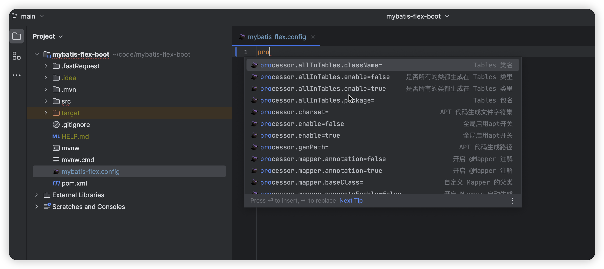
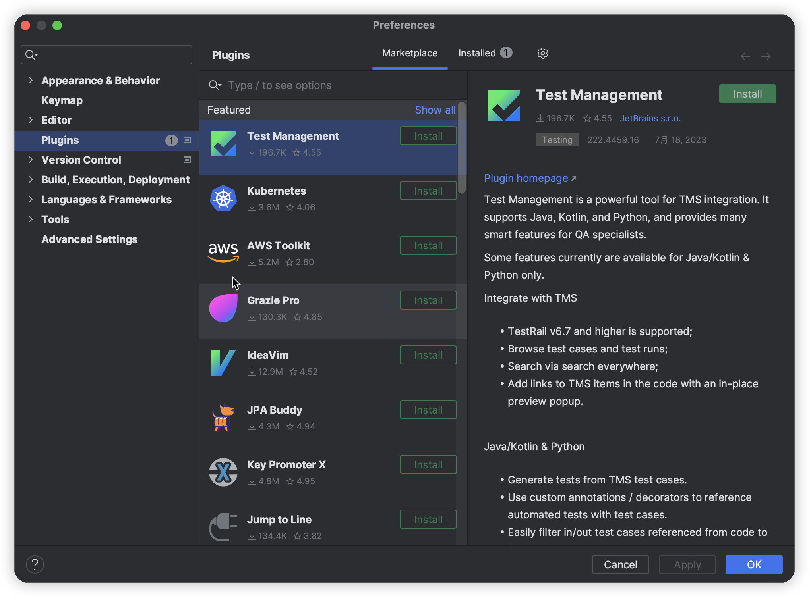
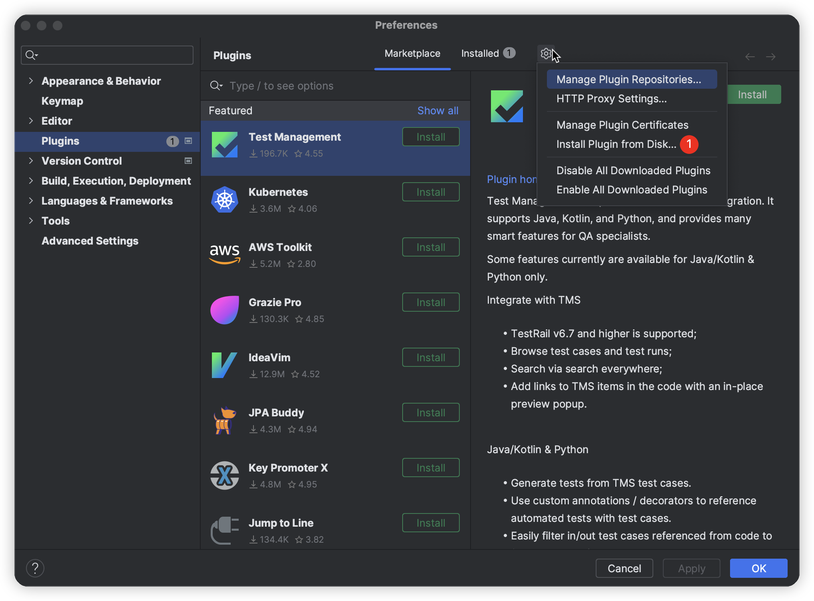
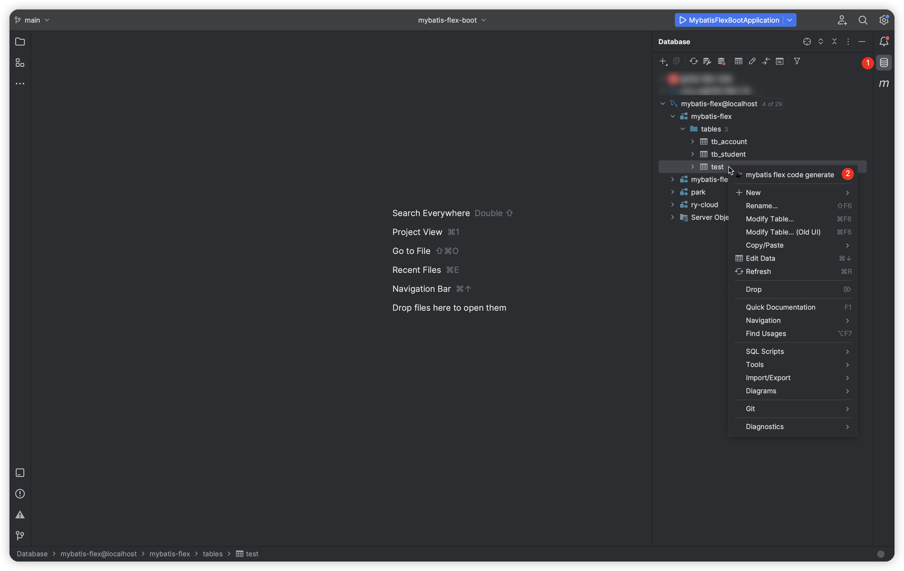
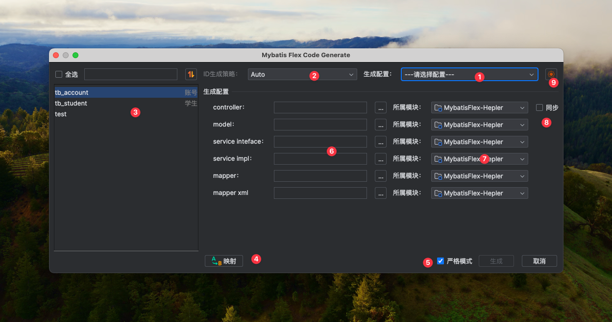
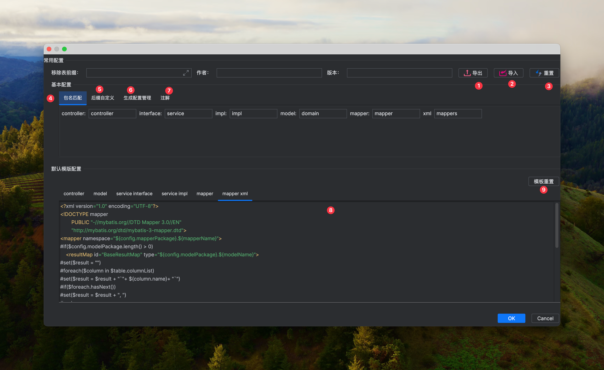

# 一、功能演示

## 1、支持 APT 提示

::: warning 现状

当前在一个java文件里面首次使用APT生成的类是没有提示的，需要全程手动敲完，再引入类路径,只有引入之后IDEA才会有APT提示

 ::: 

从动图可以看出第一次提示是插件做的，导入包之后是IDEA提示的，插件不再提示，从而避免出现两个同样的提示

## 2、生成路径自动匹配

::: tip 使用指南

在插件的设置页面选择在【基本配置】下的`包名匹配`配置适用于本项目的生成包路径最后一个包名如：实体类需要生成到`domain`包下，那么只要配置`domain`，而不是全路径

 ::: 

## 3、mybatis-flex.config 配置提示

::: warning 现状

如果没有安装插件，那么该文件的icon是一个Lombok配置的图标，编写配置没有提示，可能不小心就搞错了

 ::: 

从上图可以看到，安装插件之后该文件icon变成了插件的logo，并且配置文件也有提示了，左边是配置项，右边是配置的含义，再也不用为了配置去翻flex官网了，也支持值提示

## 4、自动生成APT文件

::: warning 现状

如果没有安装插件，那么每次修改实体类后，都要手工的去build生成

 ::: 

插件支持没有APT文件自动生成(Java/Kotlin)，支持`mybatis-flex.config`里面APT相关配置，排除生成到一个类里面

## 5、SQL 预览

::: warning 现状

当flex代码写的比较复杂的时候，很难看出对应的SQL语句是什么样，所以每次都要把项目跑起来调用接口，或者复制到单元测试当中，这一来二往浪费了很多时间

 ::: 

从上图可以看出只要右边有预览ICON，点击之后会稍等一会就会把对应的SQL给显示出来，并且提供了一键复制，最大程度简化了一系列操作，当预览的代码里面含有变量或者对象的get方法时，会默认把该参数替换成` ? `号

## 6、没有from方法的代码片段进行弱提示

::: warning 现状

在我开发插件SQL预览的功能下，发现有的时候会丢失表名，所以专门做了一个弱提示个功能，虽然说在项目上跑是会自动不上的，但是刚接手的人员可能会有一些懵，最好是按照规范来写（建议）

 ::: 

可以从上图看出，可以快速的添加from方法

## 7、安装插件的两种途径

::: warning  插件推荐下载方式

1 、🔥[加入 QQ 群](http://qm.qq.com/cgi-bin/qm/qr?_wv=1027&k=U0ufvKB9ogRAqBazz1Zxwkf_kMVJjeHB&authKey=wQC13%2Fj5Sr2c1ZaJg%2Fyz5LZNij%2FBK9D98C2OOf3thBFsV4gL6svCUNUPddCLC6cG&noverify=0&group_code=872707845)：   抢先体验内测功能，有问题反馈之后能快速修复，从而不影响大家的开发效率

2 、通过码云仓库下载发新版本 [下载](https://gitee.com/djxchi/mybatis-flex-code-gen)

3 、通过 IDEA 市场下载以及更新（需要 JetBrains工作人员审核，工作日需要 1-2 天，节假日不审核，会顺延到下一个工作日）

 ::: 

::: tip 安装指南

​		目前插件的安装方式有两种：

1、通过IDEA的插件市场搜索对应的插件名称，然后点击安装，`设置--》Plugins --》Marketplace--》搜索插件名称--》点击插件右侧的Install`

2、通过本地压缩包进行安装，在`方式一`的基础上点击`小齿轮`之后出现一个下弹框，然后点击以`Install`开头的哪个选项，然后选择对应的插件`zip/jar`压缩包

 ::: 

## 8、插件统一入口

::: tip 使用指南

可能刚接触插件的用户们可能都会有一个疑问❓，我该怎么使用这个插件，如何生成代码？带着解决以上问题的原则，故而有了以下相关界面操作的介绍

 ::: 

:one: 在这里自行连接数据库，然后选择表右击、弹出一个菜单

:two: 点击`mybatis flex code generate`

## 9、代码生成面板

:one: 用于选择保存好的`生成配置`，可以根据不同模块快速选择生成路径（配置好`生成配置`之后点击下拉框，点击`添加配置`）

:two: ID生成策略

:three: 数据库表概览（支持搜索、排序）

:four: 自定义数据库字段类型与java匹配

:five: 取消严格模式，可以单个文件生成

:six: 各种文件的生成包路径

:seven: 生成包路径对应的模块

:eight: 勾选同步之后，controller模块一旦改变，下面的所有模块都会同步

:nine: 插件设置页面

## 10、插件配置界面

:one: 导出自身配置分享给同事

:two: 导入他人提供的配置，快速适用于生产当中

:three: 恢复所有的配置（插件默认配置）

:four: 包名匹配，快速的自动在生成面板匹配对应的代码生成包路径

:five: 每个生成文件的后缀配置

:six: 可以配置生成策略：`Active Record` ，`管理生成配置`，`统一返回`，`实体类相关配置`

:seven: 第三方注解：`Lombok`、`Swagger`

:eight: 自定义代码模板

:nine: 重置代码模版

## 11、APT字段批量重命名

::: warning 现状

当我们在项目中多处使用了APT生成的文件里面的字段之后，当我们万一需要修改这个字段名的时候，那么对其应用的字段全都会报错，需要我们手动去修改

 :::
 

## 12、根据SQL生成简易的Flex代码

