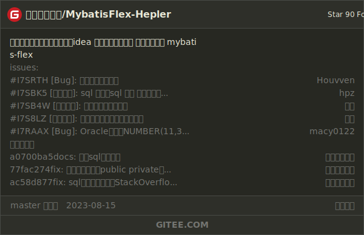
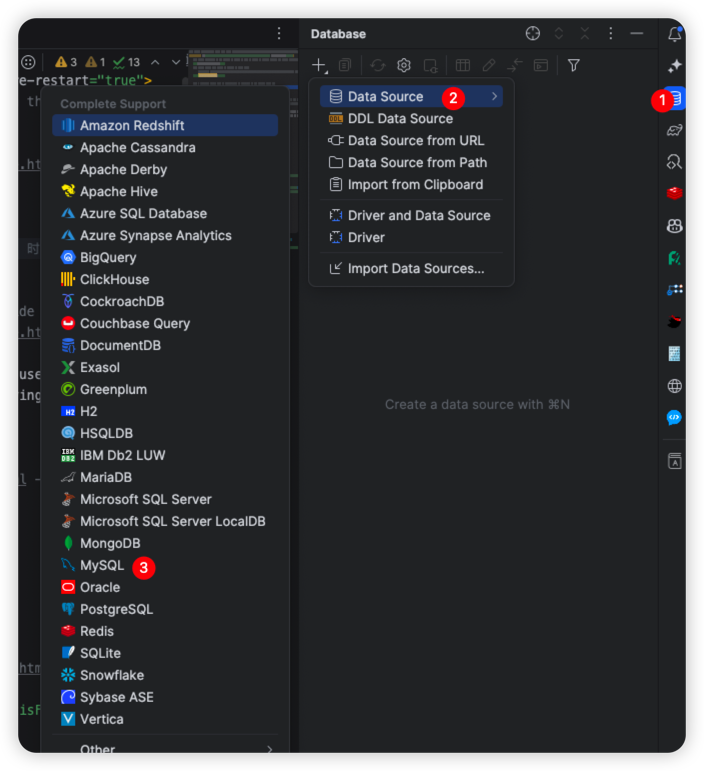
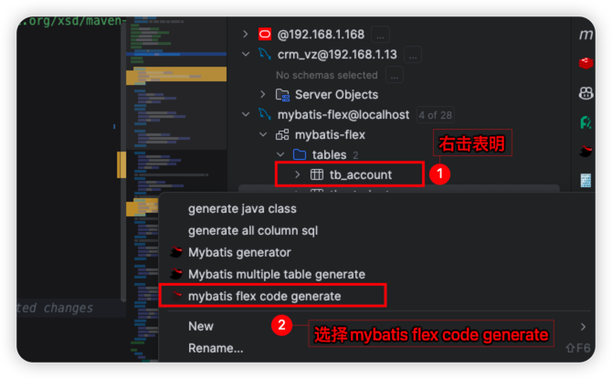
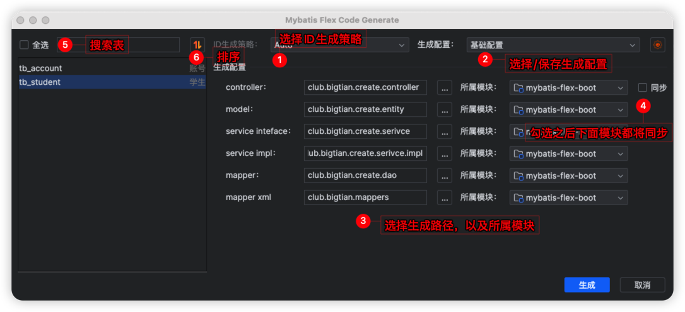
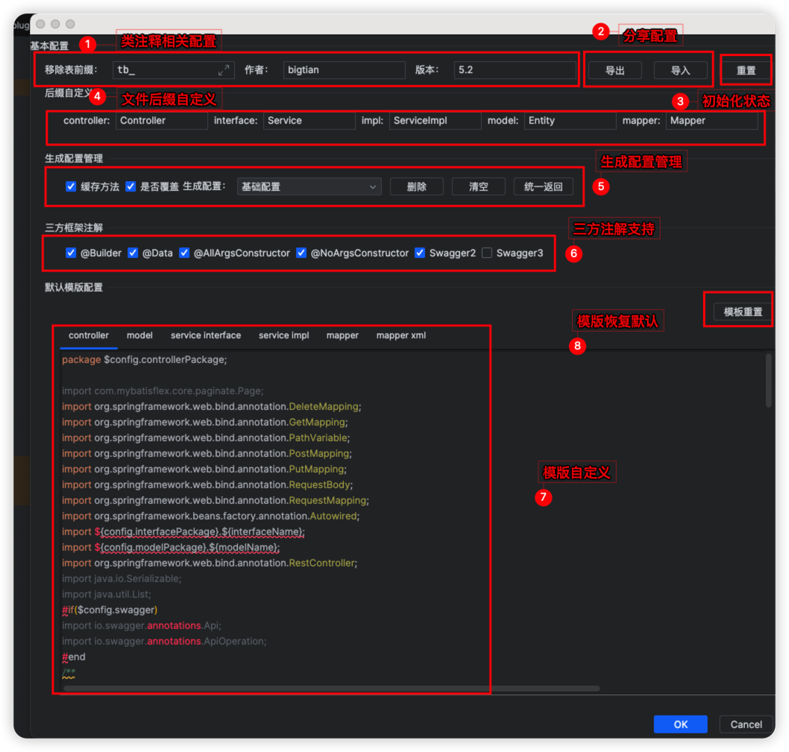
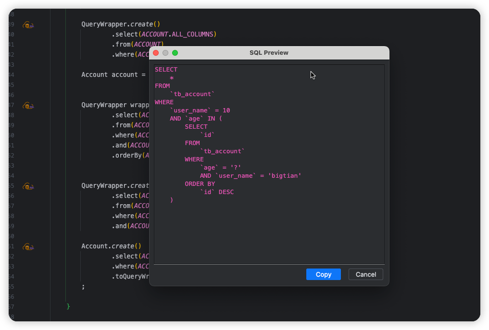

## 一、市场下载
<iframe style="border: medium none;" width="384px" height="290px" src="https://plugins.jetbrains.com/embeddable/card/22165"></iframe>

## 二、简介

`这是一款深度支持Mybatis-Flex的IDEA插件，它最大的亮点就是可以高度自定义代码生成模板，它可以快速根据表生成代码，可以使用导出/导入把配置分享给同事以便快速开发`

QQ群：872707845

[](https://gitee.com/djxchi/mybatis-flex-code-gen)


## 三、宗旨

致力于简化Mybatis-Flex用户操作繁琐且毫无意义的额外操作

## 四、代码生成

1、使用IDEA连接数据库



2、右击表名选择`mybatis flex code generate`



3、生成面板



4、设置面板



5、SQL预览



## 五、功能

1、APT自动编译

2、APT内容提示

3、SQL预览

## 六、视频演示

1 、[基础演示](https://www.bilibili.com/video/BV1yV411g7Yd/?vd_source=b6f434af852a6a39fcd34fc2de5cf431)

2 、[新增功能演示](https://www.bilibili.com/video/BV1hj411d7Rq/?vd_source=b6f434af852a6a39fcd34fc2de5cf431)

3 、[1.4.7版本新增功能演示](https://www.bilibili.com/video/BV1WX4y1j7VQ/)

## 七、:coffee:请作者喝杯咖啡


## 八、打赏名单（礼轻情意重）

| 用户  | 金额     |
|-----|--------|
| *葛  | 0.01 元 |
| *🤫 | 3 元    |
| 说都不会话了| 50 元   |
| **稳    | 9.9 元  |
| 阳灿    | 16.66 元  |
## 九、支持 SQL 预览的几种写法

::: details 其他方式

```java
         Account account1 = Account.create();
        IAccountService accountService = new IAccountServiceImpl();
        int age = 10;

        QueryChain.of(Mappers.ofEntityClass(Account.class))
                .from(Account.class)
                .where(Account::getId).eq(age)
                .and(ACCOUNT.USER_NAME.like("bigtian"))
                .limit(age)
                .list().forEach(System.out::println);

        QueryChain.of(Mappers.ofEntityClass(Account.class))
                .from(Account.class)
                .where(Account::getId).eq(100)
                .and(ACCOUNT.USER_NAME.like("bigtian"));

        QueryChain.create().from(Account.class)
                .where(Account::getId).eq(100)
                .and(ACCOUNT.USER_NAME.like("bigtian"));

        QueryChain.create(Account.create()).from(Account.class)
                .where(Account::getId).eq(100)
                .and(ACCOUNT.USER_NAME.like("bigtian"));

        QueryChain.of(Mappers.ofEntityClass(Account.class))
                .from(Account.class)
                .where(Account::getId).eq(100)
                .and(ACCOUNT.USER_NAME.like("bigtian"));

        QueryWrapper.create(Account.create())
                .from(ACCOUNT)
                .and(ACCOUNT.AGE.le(18L))
                .and(ACCOUNT.ID.ge(18L))
                .and(ACCOUNT.USER_NAME.like("bigtian"));


        QueryWrapper wrapper1 = QueryWrapper.create().from(ACCOUNT)
                .and(ACCOUNT.AGE.le(18L))
                .and(ACCOUNT.ID.ge(18L))
                .and(ACCOUNT.USER_NAME.like("bigtian"));

        UpdateChain.create()
                .from(ACCOUNT)
                .where(ACCOUNT.ID.eq(1));

        UpdateChain.create(Account.create())
                .from(ACCOUNT)
                .where(ACCOUNT.ID.eq(1));

        UpdateChain.create(Mappers.ofEntityClass(Account.class))
                .set("xxx", "xxx")
                .from(Account.class)
                .where(ACCOUNT.ID.eq(100));
        UpdateChain.of(Account.class)
                .set("xxx", "xxx")
                .from(Account.class)
                .where(ACCOUNT.ID.eq(100));
        UpdateChain.of(Account.create())
                .set("xxx", "xxx")
                .from(Account.class)
                .where(ACCOUNT.ID.eq(100)).update();
        accountService.list(QueryWrapper.create()
                .from(Account.class)
                .where(ACCOUNT.ID.eq(10)));


        System.out.println(accountService.queryChain()
                .from(ACCOUNT)
                .and(ACCOUNT.ID.ge(10))
                .list());

        System.out.println(accountService.updateChain()
                .from(ACCOUNT)
                .and(ACCOUNT.ID.ge(10))
        );

        System.out.println(accountService.query()
                .from(Account.class)
                .and(ACCOUNT.ID.ge(10)));

        accountService.page(new Page<>(), QueryWrapper.create()
                .from(Account.class)
                .where(ACCOUNT.ID.eq(10)));

        test(QueryWrapper.create()
                .from(Account.class)
                .where(ACCOUNT.ID.eq(10)), null);

        QueryWrapper.create()
                .select(ACCOUNT.ALL_COLUMNS)
                .from(ACCOUNT)
                .where(ACCOUNT.USER_NAME.eq(10));

        Account account = Account.create();


        QueryWrapper wrapper = QueryWrapper.create()
                .select(ACCOUNT.ID)
                .from(ACCOUNT)
                .where(ACCOUNT.AGE.eq(account.getAge()))
                .and(ACCOUNT.USER_NAME.eq("bigtian"))
                .orderBy(ACCOUNT.ID.desc());


        QueryWrapper.create()
                .select(ACCOUNT.ALL_COLUMNS)
                .from(ACCOUNT)
                .where(ACCOUNT.USER_NAME.eq(10))
                .and(ACCOUNT.AGE.in(wrapper));

        Account.create()
                .select(ACCOUNT.ALL_COLUMNS)
                .where(ACCOUNT.ID.eq(12))
                .toQueryWrapper();

```

 :::

::: details Service 特有➕其他方式

1 、queryChain()、this.queryChain()

```java
      queryChain()
                .from(ACCOUNT)
                .and(ACCOUNT.ID.ge(10));
```

2、updateChain()、this.updateChain()

```java
    updateChain()
                .from(ACCOUNT)
                .and(ACCOUNT.ID.ge(10));
```

3、 query()、this.query()

```java
     query()
                .from(ACCOUNT)
                .and(ACCOUNT.ID.ge(10))
```

 :::

::: details Mapper 特有➕其他方式

```java
   UpdateChain.create(this)
                .from(Account.class)
                .set("xxx", "xxx")
                .where(ACCOUNT.ID.eq(100));
```

 :::
