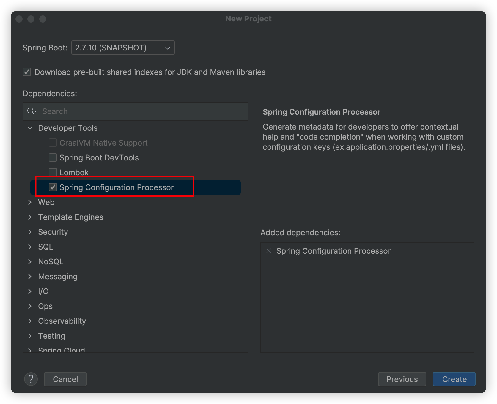
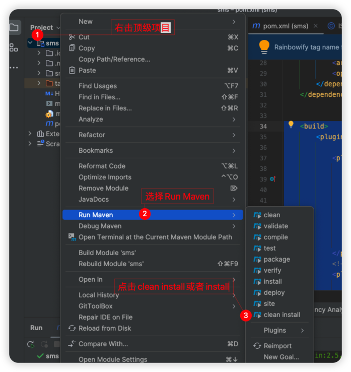
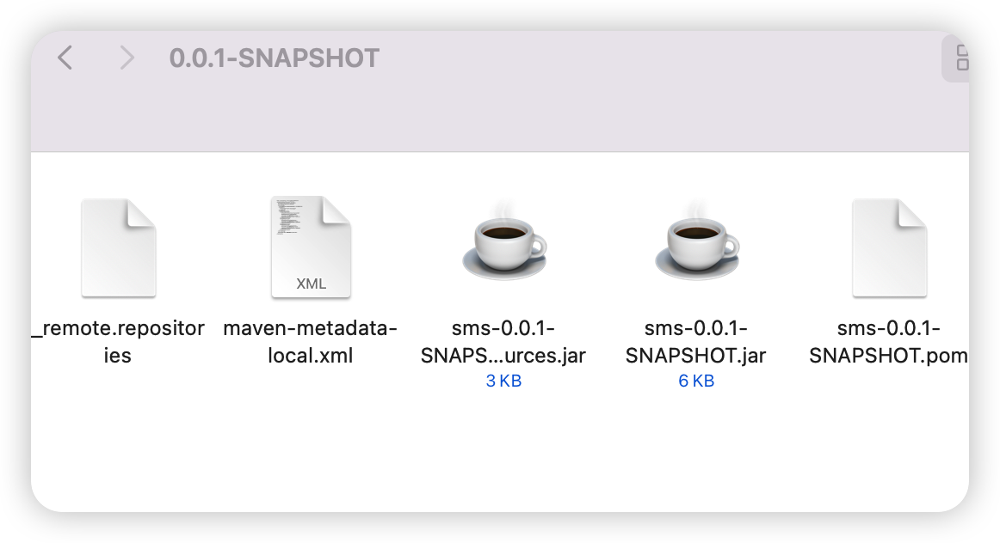
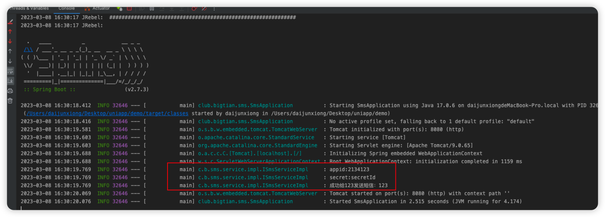
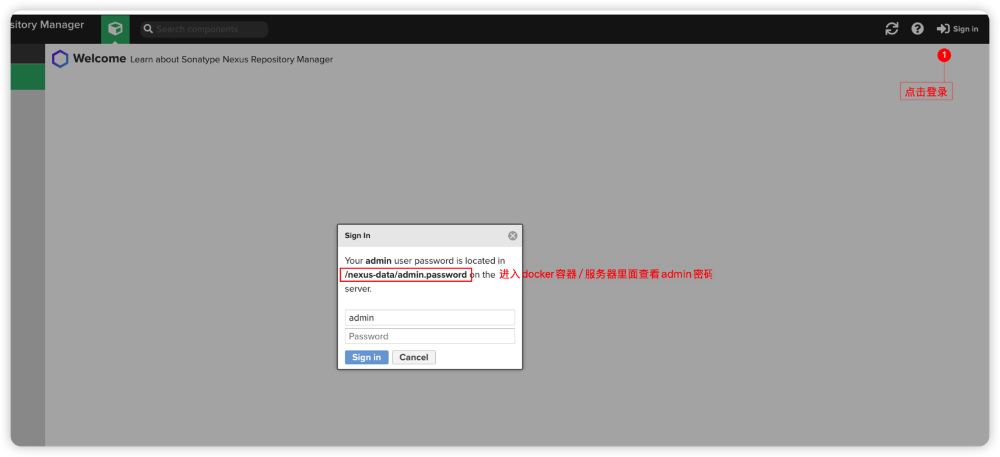
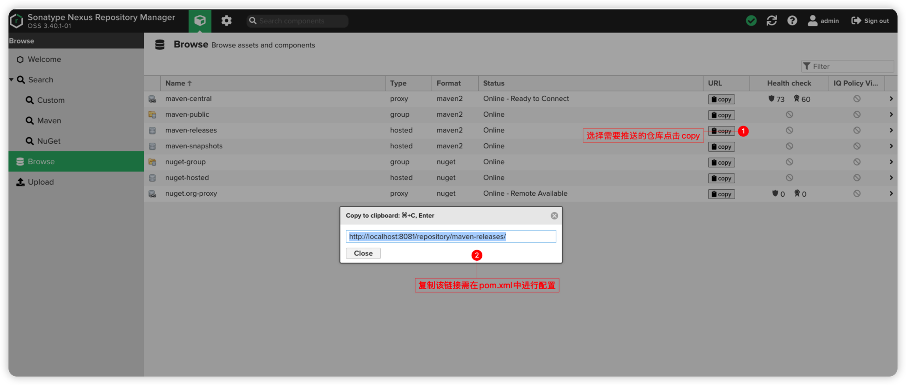
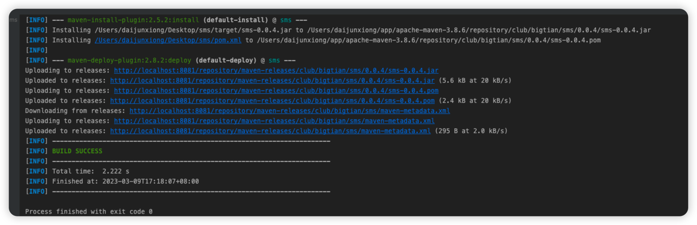
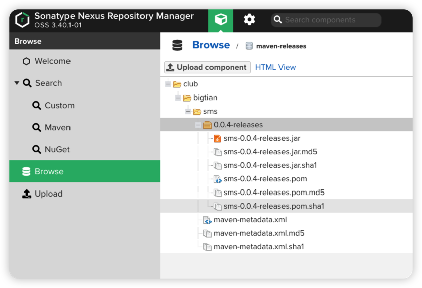
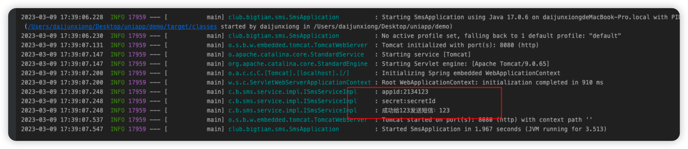

##  一、什么是SpringBoot [starter](https://so.csdn.net/so/search?q=starter&spm=1001.2101.3001.7020)机制

SpringBoot中的starter是一种非常重要的机制(自动化配置)，能够抛弃以前繁杂的配置，将其统一集成进starter，应用者只需要在maven中引入starter依赖，SpringBoot就能自动扫描到要加载的信息并启动相应的默认配置。

starter让我们摆脱了各种依赖库的处理，需要配置各种信息的困扰。SpringBoot会自动通过classpath路径下的类发现需要的Bean，并注册进IOC容器。SpringBoot提供了针对日常企业应用研发各种场景的spring-boot-starter依赖模块。

所有这些依赖模块都遵循着约定成俗的默认配置，并允许我们调整这些配置，即遵循“约定大于配置”的理念。

## 二、为什么要自定义starter

在我们的日常开发工作中，经常会有一些独立于业务之外的配置模块，我们经常将其放到一个特定的包下，然后如果另一个工程需要复用这块功能的时候，需要将代码硬拷贝到另一个工程，重新集成一遍，麻烦至极。

如果我们将这些可独立于业务代码之外的功配置模块封装成一个个starter，复用的时候只需要将其在pom中引用依赖即可，SpringBoot为我们完成自动装配，简直不要太爽

## 三、什么时候需要创建自定义starter

在我们的日常开发工作中，可能会需要开发一个通用模块，以供其它工程复用。SpringBoot就为我们提供这样的功能机制，我们可以把我们的通用模块封装成一个个starter，这样其它工程复用的时候只需要在pom中引用依赖即可，由SpringBoot为我们完成自动装配。

常见场景：
   1.通用模块-短信发送模块
   2.基于AOP技术实现日志切面
  3.分布式雪花ID，Long-->string

## 四、自定义starter的开发流程

##### 自定义starter的开发流程：

1.  创建Starter项目
2.  定义Starter需要的配置类(Properties)
3.  编写Starter项目的业务功能
4.  编写自动配置类
5.  编写spring.factories文件加载自动配置类
6.  打包安装（推送到私服/中央仓库）
7.  其它项目引用

## 五、命名规范

 SpringBoot官方命名方式
       格式：spring-boot-starter-{模块名}
       举例：spring-boot-starter-web
       自定义命名方式
       格式：{模块名}-spring-boot-starter
       举例：mystarter-spring-boot-starter

## 六、正式开始

#### 一、使用idea创建一个springBoot项目（版本小于3.0）

默认在Idea系统设置配好了本地的maven环境

`勾选下图必要依赖`



#### 二、编写相关属性配置类

```java	

/**
 * 统一sms作为配置前缀
 */
@ConfigurationProperties(prefix = "sms")
@Configuration
public class SmsProperties {
    /**
     * 应用id
     */
    private String appId;

    /**
     * 应用秘钥
     */
    private String secretId;

	//省略get/set
}
```

#### 三、服务提供类

```java

/**
 * The interface Sms service.
 */
public interface ISmsService {
    /**
     * Send msg.
     *
     * @param phone the phone
     * @param msg   the msg
     */
    void sendMsg(String phone, String msg);
}

```

```java
@Component
public class ISmsServiceImpl implements ISmsService, Serializable {
    @Autowired
    SmsProperties smsProperties;
  
    Logger logger = LoggerFactory.getLogger(ISmsServiceImpl.class);

    @Override
    public void sendMsg(String phone, String msg) {
        logger.info(String.format("appid:%s", smsProperties.getAppId()));
        logger.info(String.format("secret:%s", smsProperties.getSecretId()));
        logger.info(String.format("成功给%s发送短信：%s", phone, msg));
    }
}

```

#### 四、配置自动装配类

##### 方式一：手动创建相关对象交友ioc容器进行管理

```java
/**
 * @author bigtian
 */
@Configuration
@EnableConfigurationProperties({SmsProperties.class})
public class SmsAutoConfig {
    /**
     * 此注解是当bean容器里面没有这个bean的时候才会注入，也就是说不会覆盖掉用户自己定义的bean
     */
    @ConditionalOnMissingBean(ISmsService.class)
    @Bean
    public ISmsService smsProperties() {
        return new ISmsServiceImpl();
    }
}
```

##### 方式一：使用spring相关特性

```java
/**
 * @author bigtian
 */
@Configuration
/**
*配置需要交由ioc管理的bean对象包路径
*此方法必须配合相关注解如：@Component、@Service等交由ioc管理的注解
*不能扫描到类上面标注了@ConditionalOnMissingBean的嘞
*/
@ComponentScan(basePackages = {"club.bigtian.sms.*"})
public class SmsAutoConfig {
    
}

```


#### 五、编写spring.factories文件加载自动配置类

在`resources`目录下新建一个`META-INF`文件夹，然后创建`spring.factories`文件

编辑`spring.factories`文件

`切记不可一次性创建完成`,下图标注的是错误的


> 配置规则

```sh
规则：`多个自动配置类可以用逗号和\隔开`
org.springframework.boot.autoconfigure.EnableAutoConfiguration=\
  自动配置类全路径
 
示例：

单个：
org.springframework.boot.autoconfigure.EnableAutoConfiguration=\
club.bigtian.sms.config.SmsAutoConfig

多个：
org.springframework.boot.autoconfigure.EnableAutoConfiguration=\
club.bigtian.sms.config.SmsAutoConfig,\
club.bigtian.sms.config.SmsAutoConfig
```

#### 六、打包测试

##### 一、打包

1、在pom.xml中加入以下下配置

```xml
	<build>
		<plugins>
			<plugin>
				<groupId>org.apache.maven.plugins</groupId>
				<artifactId>maven-compiler-plugin</artifactId>
				<version>3.10.1</version>
				<configuration>
					<encoding>utf-8</encoding>
					<source>8</source>
					<target>8</target>
				</configuration>
			</plugin>
			<!-- 生成java source.jar -->
			<plugin>
				<groupId>org.apache.maven.plugins</groupId>
				<artifactId>maven-source-plugin</artifactId>
				<version>2.2.1</version>
				<executions>
					<execution>
						<id>attach-sources</id>
						<goals>
							<goal>jar-no-fork</goal>
						</goals>
					</execution>
				</executions>
			</plugin>
		</plugins>
	</build>
```

##### 2、使用maven打包到本地仓库



稍等片刻后就会把starter打进本地仓库，如下图就已经成功了



#### 二、测试starter

##### 1、新建一个新的spring boot项目

##### 2、在pom.xml中引入manven坐标

```xml
		<dependency>
			<groupId>club.bigtian</groupId>
			<artifactId>sms</artifactId>
			<version>0.0.1-SNAPSHOT</version>
		</dependency>
```

##### 3、配置yml

```yaml
sms:
  app-id: 2134123
  secret-id: secretId
```

##### 4、启动程序



如上图输出便是成功了，本章结束

## 二、Starter打包到私服/中央仓库

> 前提
>
> 到此默认自定义starter已经成功，接下来是基于上方做些配置

### 一、安装私服

```sh
docker run -d -p 8081:8081 --name nexus sonatype/nexus3
```

启动后登录默认用户名为`admin`密码需要进入docker/liunx相对应的文件查看



#### 二、配置maven settings.xml文件

```xml
  <servers>
    <server>
        <id>id（建议以releases、snapshots命名）</id>
        <username>私服账号</username>
        <password>私服密码</password>
    </server>
  </servers>
```

#### 三、获取推送仓库链接



#### 四、配置pom.xml

```xml
       <!--配置远程推送仓库相关信息-->
    <distributionManagement>
        <repository>
            <id>需与第二步的id一致</id>
            <name>随意取名</name>
            <url>第三步的仓库链接</url>
        </repository>
    </distributionManagement>

    <!--	配置私服地址-->
    <repositories>
        <repository>
            <id>releases</id>
            <name>releases</name>
            <url>第三步的仓库链接</url>
            <releases>
                <enabled>true</enabled>
            </releases>
        </repository>
    </repositories>
```

#### 五、打包进私服

###### 1、执行命令`mvn deploy`之后等待打包程序执行完成，如下图所示即为成功



###### 2、进入私服查看对应的仓库内容



###### 3、清除本地仓库的相关jar包

###### 4、进入idea刷新Maven依赖

###### 5、启动项目看日志输出，如下图所示即为成功



本章教程结束，下次再见👋🏻
