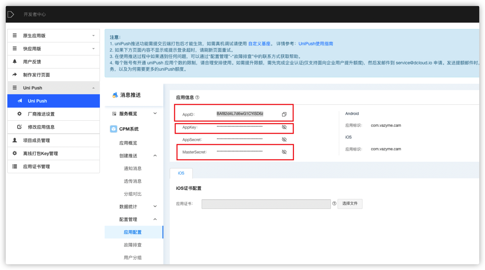

# 厂商离线消息推送（华为）

#### 1、消息推送

> ​	配置华为离线消息推送 [华为开发者后台](https://id1.cloud.huawei.com/CAS/portal/loginAuth.html?reqClientType=89&loginChannel=89000000&countryCode=cn&loginUrl=https%3A%2F%2Fid1.cloud.huawei.com%3A443%2FCAS%2Fportal%2FloginAuth.html&lang=zh-cn&themeName=red&clientID=6099200&service=https%3A%2F%2Foauth-login1.cloud.huawei.com%2Foauth2%2Fv2%2Flogin%3Faccess_type%3Doffline%26client_id%3D6099200%26display%3Dpage%26flowID%3D0321ff69-7399-4620-8f5a-5a3e0bd0a3b8%26h%3D1632536976.8690%26lang%3Dzh-cn%26redirect_uri%3Dhttps%253A%252F%252Fdeveloper.huawei.com%252Fconsumer%252Fcn%252Fdevunion%252FopenPlatform%252Frefactor%252FhandleLogin.html%26response_type%3Dcode%26scope%3Dopenid%2Bhttps%253A%252F%252Fwww.huawei.com%252Fauth%252Faccount%252Fcountry%2Bhttps%253A%252F%252Fwww.huawei.com%252Fauth%252Faccount%252Fbase.profile%26state%3D592936%26v%3Df1c9c8d6a323bd21187d5601d9fa6afc4803b02eec28e74f623ab6d00e8eb00a&validated=true)


> ​	华为后台创建项目(点击上一步的PUSH)后会跳转到下方界面


>添加应用


> 填写应用信息（填写完成，根据提示就会跳转到下图）


> 下载并配置以下内容


> ​	开通推送服务


> ​	在Dcloud开发者后台配置厂商离线


> java编写个推工具类
>
> 个推接口官网：https://docs.getui.com/getui/server/rest_v2/push/
>
> 使用个推推送消息，不需要开发者判定走在线推送还是离线推送，个推已经处理

```xml
//在java项目中pom.xml 导入maven坐标
<dependency>
   <groupId>com.getui.push</groupId>
   <artifactId>restful-sdk</artifactId>
   <version>1.0.0.2</version>
</dependency>
```


> 获取个推appkey、masterSecret
>
> 进入dcloud后台选择对应的应用



> java代码

```java
//获取个推token    
public  String getToken() {
   			//String appKey = "gOBB8K7rED6fZSexU17K6A";
        //String masterSecret = "QzF7A3pr5Q6jAJsUisgH84";
        Map<String, Object> data = new HashMap<>();
        long now = System.currentTimeMillis();
        String sign = appKey + now + masterSecret;
        data.put("sign", SecureUtil.sha256(sign));
        data.put("timestamp", now);
        data.put("appkey", appKey);
        String result = HttpRequest.post(baseUrl + "/auth")
                .body(JSON.toJSONString(data))
                .execute()
                .body();
        return JSON.parseObject(result).getJSONObject("data").getString("token");
    }

    /**
     * cids 多个用逗号分开
     * params 包含 title,body
     * 其他参数配置 参考https://docs.getui.com/getui/server/rest_v2/push/
     * @param cids
     * @param params 
     */
    public  boolean sendByCid(String cids, Map<String, Object> params) {
        params.put("badge_add_num", 1);
        params.put("click_type", "intent");
        params.put("intent", "intent:#Intent;launchFlags=0x04000000;action=android.intent.action.oppopush;component=com.vazyme.cam/io.dcloud.PandoraEntry;S.title=bigtian;end");
        Map<String, Object> audienceMap = new HashMap<>();
        Map<String, Object> parmasMap = new HashMap<>();
        parmasMap.put("notification", params);
        audienceMap.put("cid", cids.split(","));
        String token = getToken();
        Map<String, Object> data = new HashMap<>();
        data.put("request_id", IdWorker.get32UUID());
        data.put("audience", audienceMap);
        data.put("push_message", parmasMap);
        Map<String, Object> pushChannelMap = new HashMap<>();
        Map<String, Object> upsMap = new HashMap<>();
        Map<String, Object> notificationMap = new HashMap<>();
        for (Map.Entry<String, Object> entry : params.entrySet()) {
            notificationMap.put(entry.getKey(), entry.getValue());
        }
        Map<String, Object> stringObjectHashMap = new HashMap<>();
        stringObjectHashMap.put("notification", notificationMap);
        upsMap.put("ups", stringObjectHashMap);
        pushChannelMap.put("android", upsMap);
        data.put("push_channel", pushChannelMap);
        String result = HttpRequest.post(baseUrl + "/push/single/cid")
                .header("token", token)
                .body(JSON.toJSONString(data))
                .execute()
                .body();
        log.info("个推返回数据{}",result);
        return JSON.parseObject(result).getInteger("code") == 0;
    }
```
