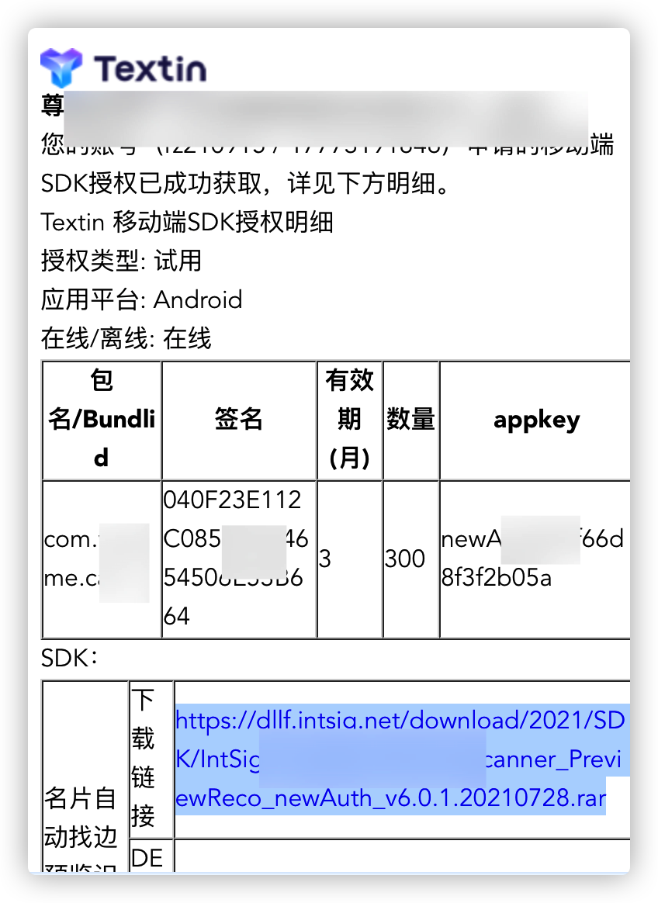

# 集成第三方SDK

## 开发流程

> 1、获取其他公司提供的sdk
>
> 2、阅读其他公司提供的接口文档
>
> 3、按照接口文档导入相关jar/aar包，以及相关配置
>
> 4、根据提供的demo编写自己的功能
>
> 5、打包运行在手机

## 开发技巧

### 1、集成企业微信

> 前言
>
> uniapp官方并没有提供调用企业微信登录的api，所以得用安卓和IOS原生方式，下面演示安卓原生

> [下载企业微信SDK](https://work.weixin.qq.com/api/doc/90000/90136/91194)


> ​	通过该方法的回调可以拿到企业微信返回的code，下图是安卓代码


> ​	现在可以拿到企业微信登录返回的code了，那么怎么返回给uniapp获取userId呢？```下面是分析与解决方案（详细分析每个方法的弊端）```

> ​	分析：企业微信回调是异步的所有同步返回是不可行的

> ​	解决方案
>
> ​	1、之前试过使用原生的Intent传值（没能达到预期，可能是对安卓不太熟悉）
>
> ​    2、那我就行别让这个方法执行完毕嘛，那就在返回前一直循环等待拿到code，这个方法果然可行，但是也引申出了一个问题，这样会```导致软件卡死，果断放弃```
>
> ​	3、用了```CountDownLatch```来解决软件卡死问题，果然这个方法不会导致软件卡死问题了，但是又引申出了另一个问题，那就是假如我不点击登录，那么```countLatch```这个方法没有执行，线程一直阻塞在方法返回前，从而又导致软件卡死。。。
>
> ​	4、```最终解决方案```	在Android类中定义一个用来存放企业微信返回的code的静态属性，再定义一个返回这个code的方法（大功告成，怎么玩都不会卡死了，非常的nice ~ ~）下图 贴uniapp的代码
>
> 5、最优解（后面发现的），uniapp提供了一个方法回调可以使用 [uniapp与原生代码回调](https://nativesupport.dcloud.net.cn/UniMPDocs/Extension/android?id=jscallback%e7%bb%93%e6%9e%9c%e5%9b%9e%e8%b0%83)


```该方法的意思就是在每次页面显示的时候调用这个方法```，以上就是企业微信登录的操作

## 2、微信分享

> 分析
>
> uniapp本身就提供了分享的功能，在使用线上打包的时候本身的分享是可以使用的，但是为了实现企业微信登录，使用了Android离线打包，这个就会导致本身自带的分享功能失效，最后使用安卓代码实现微信分享功能


> ​	配置安卓微信分享

> [uniapp配置指导](https://nativesupport.dcloud.net.cn/AppDocs/usemodule/androidModuleConfig/share)

> 导入需要的jar/aar文件(刚开始下载的SDK中有以下包)


> [Androidmainfest.xml文件需要修改的项](https://nativesupport.dcloud.net.cn/AppDocs/usemodule/androidModuleConfig/share?id=androidmainfestxml文件需要修改的项)

>需要在application节点前添加权限

```xml
<uses-permission android:name="android.permission.MODIFY_AUDIO_SETTINGS"/>
<!--节点下配置如下代码-->
<!-- 微信分享 配置begin -->
<meta-data android:name="WX_APPID" android:value="%微信开放平台申请应用的AppID%">
</meta-data>
<meta-data android:name="WX_SECRET" android:value="%微信开放平台申请应用的Secret%">
        </meta-data>
        <activity
            android:name="【包名】.wxapi.WXEntryActivity"
            android:label="@string/app_name"
            android:exported="true"
            android:launchMode="singleTop">
            <intent-filter>
                <action android:name="android.intent.action.VIEW"/>
                <category android:name="android.intent.category.DEFAULT"/>
                <data android:scheme="%微信开放平台申请应用的AppID%""/>
            </intent-filter>
        </activity>
        <!-- 微信分享 配置 end -->

```

> properties.xml需要添加如下代码

```xml
<!--properties.xml文件在assets/data目录下-->
<feature name="Share" value="io.dcloud.share.ShareFeatureImpl"><module name="Weixin" value="io.dcloud.share.mm.WeiXinApiManager"/></feature>

<!--
提示：
1) androidmanifest.xml文件中声明的包名必须与申请微信appkey使用的包名一致，否则分享插件会调用失败

2) 微信分享测试需要使用在微信开放平台申请应用时使用的应用签名文件进行签名打包，否则无法获取好友列表。
-->

```

> uniapp端代码

```js
	share() {
//自己定义参数对象
				var data = {
					title: `${this.userInfo.staffName}`,
					href: `https://crm.vazyme.com/cam-render/carddetail/${
						this.userInfo.staffCode
					}/N`,
					content: `${this.userInfo.positionName} \r\n${this.userInfo.staffMobile}\r\n ${
						this.userInfo.companyName
					}`,
					thumb:
						'https://vzocr-test.oss-cn-shanghai.aliyuncs.com/2021-08-24/7070397418ee4dce458dae287ad21b68.20201010170111.22535796062370120467965008854576.png'
				};
				var main = plus.android.runtimeMainActivity();
				var WXLoginAndShareActivity = plus.android.importClass('com.vazyme.cam.WXLoginAndShareActivity');
				var share = new WXLoginAndShareActivity();
				//这里要转json，直接传对象的话安卓那边会出现问题
				share.wechatShare(JSON.stringify(data));

}

```

> 安卓代码

```java
    /**
     * 微信分享 （这里仅提供一个分享网页的示例，其它请参看官网示例代码）
     */
    public void wechatShare(String data) {
        JSONObject map = JSON.parseObject(data);
        WXWebpageObject webpage = new WXWebpageObject();
        webpage.webpageUrl = map.getString("href");
        WXMediaMessage msg = new WXMediaMessage(webpage);
        msg.title = map.getString("title");
        msg.description = map.getString("content");
        //这里替换一张自己工程里的图片资源
        msg.setThumbImage(getBitmap(map.getString("thumb")));

        SendMessageToWX.Req req = new SendMessageToWX.Req();
        req.transaction = String.valueOf(System.currentTimeMillis());
        req.message = msg;
        req.scene = SendMessageToWX.Req.WXSceneSession;
        boolean flag = wxApi.sendReq(req);
        finish();
    }
		/**
     * url转成bitMap
     *
     * @param url
     * @return
     */
    public Bitmap getBitmap(String url) {
        Bitmap bm = null;
        try {
            URL iconUrl = new URL(url);
            URLConnection conn = iconUrl.openConnection();
            HttpURLConnection http = (HttpURLConnection) conn;
            int length = http.getContentLength();
            conn.connect();
            // 获得图像的字符流
            InputStream is = conn.getInputStream();
            BufferedInputStream bis = new BufferedInputStream(is, length);
            bm = BitmapFactory.decodeStream(bis);
            bis.close();
            // 关闭流
            is.close();
        } catch (Exception e) {
            e.printStackTrace();
        }
        return bm;
    }
```

## 3、集成第三方SDK

> [下载名片王提供的sdk](https://dllf.intsig.net/download/2021/SDK/IntSig_Android_BcrAutoScanner_PreviewReco_newAuth_v6.0.1.20210728.rar	)
>
> Sdk目录结构名片王的文档在doc中




> ​	按照文档操作到第三步即可

> ​	```在build.gradle中配置，一定要配置，否则不会出现效果```
>
> ```xml
> sourceSets {
> main {
>   jniLibs.srcDirs = ['libs']
> }
> }
> ```

> ​	使用Android studio打开提供的demo

> ​	拷贝demo中的代码到自己项目中去（以自己项目为准，```对比拷贝```）


> ​	16.5、看下MainActivity中的代码


上图的按钮对应着MainActivity中的这个方法

```java
    /**
     * 功能：启动调用CameraCommonLib封装的名片自动拍功能
     */
    public void startOcrRecognize() {
        CapturePreviewActivity.setResultCallback(this);//注：设置识别接口回调
        Intent intent = new Intent(this, CapturePreviewActivity.class);
        intent.putExtra(CapturePreviewActivity.EXTRA_INIT_APPKEY, APPKEY);//授权key，也就是邮箱中的那个appkey
        intent.putExtra(CapturePreviewActivity.EXTRA_BOOL_NEED_CROPIMAGE, true);//名片是否切边
        intent.putExtra(CapturePreviewActivity.EXTRA_BOOL_NEED_PRECISE, false);//名片是否精准识别
        intent.putExtra(CapturePreviewActivity.EXTRA_TITLE_UNNORMAL_COLOR, Color.WHITE);//自动拍照预览框警告字体提示颜色
        intent.putExtra(CapturePreviewActivity.EXTRA_TITLE_UNNORMAL_RECT_COLOR, Color.RED);//自动拍照预览框警告字体内容框提示颜色
        intent.putExtra(CapturePreviewActivity.EXTRA_PREVIEW_RECT_UNNORMAL_COLOR, 0xffff0000);//自动拍照预览框  no Match提示颜色
        intent.putExtra(CapturePreviewActivity.EXTRA_PREVIEW_RECT_NORMAL_COLOR, 0xffffffff);//自动拍照预览框 Match提示颜色
        intent.putExtra(CapturePreviewActivity.EXTRA_SCREEN_PREVIEW_BACK_COLOR, 0xff6d9eeb);//自动拍照预览框 整个屏幕背景色
        intent.putExtra(CapturePreviewActivity.EXTRA_TITLE_TEXT_SIZE, 18);//自动拍照预览框警告字体大小
        intent.putExtra(CapturePreviewActivity.EXTRA_PREVIEW_RECT_STROKSIZE, 2);//自动拍照预览框 边框大小

        startActivity(intent);
      //关闭当前页
        finish();
    }
```

> ​	下图就是名片王拍照后回调的方法（可在方法里自定义处理，参数是byte数组）


以上就是Android 代码

> ​	uniapp调用sdk代码

```js
//获取宿主上下文
			var main = plus.android.runtimeMainActivity();
			//通过反射获取Android的Intent对象
			var Intent = plus.android.importClass('android.content.Intent');
			//通过宿主上下文创建 intent
			var intent = new Intent(main.getIntent());
			//设置要开启的Activity包类路径  com.HBuilder.integrate.MainActivity换掉你自己的界面
			// intent.setClassName(main, 'com.intsig.libcamera.CapturePreviewActivity');
			intent.setClassName(main, 'com.vazyme.cam.CameraActivity');
			//开启新的任务栈 （跨进程）
			intent.setFlags(Intent.FLAG_ACTIVITY_NEW_TASK);
			//向原生界面传值操作
			intent.putExtra('EXTRA_INIT_APPKEY', 'newAuthf57f66d8f3f2b05a');
			intent.putExtra('EXTRA_BOOL_NEED_CROPIMAGE', true); //是否切边
			intent.putExtra('EXTRA_BOOL_NEED_PRECISE', false); //是否精确识别
			intent.putExtra('EXTRA_TITLE_UNNORMAL_COLOR', 0xffffffff); //自动拍照预览框警告字体提示颜色
			intent.putExtra('EXTRA_TITLE_UNNORMAL_RECT_COLOR', 0xffff0000); //自动拍照预览框警告字体内容框提示颜色
			intent.putExtra('EXTRA_PREVIEW_RECT_UNNORMAL_COLOR', 0xffff0000); //自动拍照预览框  no Match提示颜色
			intent.putExtra('EXTRA_PREVIEW_RECT_NORMAL_COLOR', 0xffffffff); //自动拍照预览框 Match提示颜色
			intent.putExtra('EXTRA_SCREEN_PREVIEW_BACK_COLOR', 0xff6d9eeb); //自动拍照预览框 整个屏幕背景色
			intent.putExtra('EXTRA_TITLE_TEXT_SIZE', 18); //自动拍照预览框警告字体大小
			intent.putExtra('EXTRA_PREVIEW_RECT_STROKSIZE', 2); //自动拍照预览框 边框大小
			//开启新的界面
			main.startActivity(intent);
```

> ​	这一步就是跳转到16.5那个页面，要想直接跳转到相机界面则需要在CameraActivity（也就是刚刚从demo中拷贝过来的MainActivity）的onCreate方法中自己去手动调用下16.5中的```startOcrRecognize```方法，以上就是对接名片王的方法
