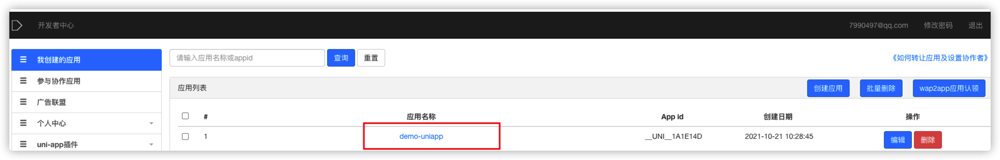
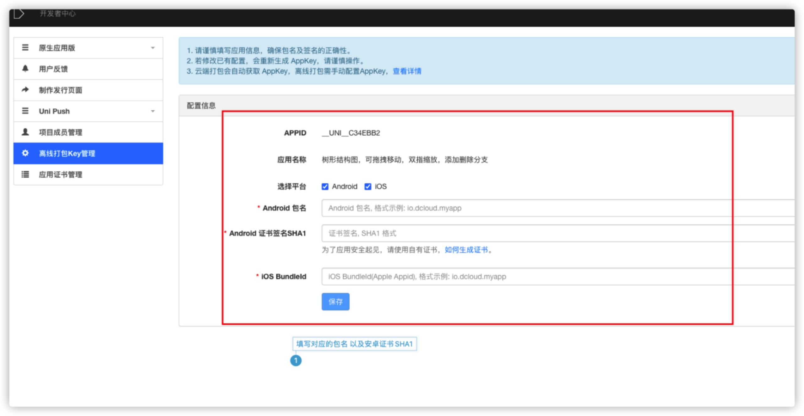

# uniapp入门到打包

## uniapp官方插件库

官方插件库的存在意义就是为了方便开发者避免重复的造车轮子，把精力都投入到业务代码的编写中去，尽可能的减少开发者编写组件的时间

> [官方插件库](https://ext.dcloud.net.cn/)

## uniapp配置项

> `pages.json` 文件用来对 uni-app 进行全局配置，决定页面文件的路径、窗口样式、原生的导航栏、底部的原生tabbar 等。
>
> 它类似微信小程序中`app.json`的**页面管理**部分。注意定位权限申请等原属于`app.json`的内容，在uni-app中是在manifest中配置。		
>
> [配置项列表](https://uniapp.dcloud.io/collocation/pages)

## manifest.json配置项

> `manifest.json` 文件是应用的配置文件，用于指定应用的名称、图标、权限等。HBuilderX 创建的工程此文件在根目录，CLI 创建的工程此文件在 src 目录。
>
> [配置列表](https://uniapp.dcloud.io/collocation/manifest)

## Android的模块和权限

> ​	[模块和权限含义](https://www.cnblogs.com/mxm2005/p/4782175.html)

#### 1、开发流程

#### 1、注册Dcloud开发者账号

> [注册地址](https://account.dcloud.net.cn/oauth2?client_id=DCLOUD_DEV&redirect_uri=http%3A%2F%2Fdev.dcloud.net.cn%2Fauth%2Fdcloud%2Fcallback&scope=&response_type=code)


#### 2、下载所需工具

> [HBuilderX下载地址](https://www.dcloud.io/hbuilderx.html)      [Android Studios下载地址](https://developer.android.google.cn/studio/index.html)     [SDK下载地址](https://nativesupport.dcloud.net.cn/AppDocs/download/android)

#### 3、使用HBuilderX登录开发者账号

> 打开HBuilderX后点击左下角	```未登录```


#### 4、新建项目

> ​	1、打开HBuilderX后右击左侧菜单——》新增——》项目——》uniapp


#### 5、登录开发者后台

> ​	就可以在我创建的应用中看到刚才新建的项目



#### 6、打包

##### 1、离线打包

> ​	准备离线打包环境

> ​	搭建安卓离线打包环境并获取离线打包key

1、官方指导文档链接：https://nativesupport.dcloud.net.cn/AppDocs/usesdk/android

2、安装Android于HBuilderX的环境（```以及申请离线打包APPKEY```）


```使用Android studio导入```


3、进入Dcloud开发者后台对对应的app应用填写相关信息以获取离线APPKEY

> ​	生成应用证书


> 填写对应的app信息




> ​	使用HBuilderX生成app本地资源


> ​	可能会在导出的时候会提示缺少插件，按照控制台的提示安装即可


> app本地资源导入Android Studio

1、把生成的__UNI__A6D0A36/www文件拷贝到Android Studio中去具体位置看图（把原来的的删掉）


> 配置Appkey

> ​	打开Androidmanifest.xml， 导航到Application节点，创建meta-data节点，name为dcloud_appkey，value为申请的AppKey如下：
>
> ```xml
> <application
> ...>
> <meta-data
>    android:name="dcloud_appkey"
>    android:value="替换为自己申请的Appkey" />
> ```

>修改Androidmanifest.xml
>
>```xml
><manifest xmlns:android="http://schemas.android.com/apk/res/android"
>package="项目的主包路径">
>// package="com.vazyme.cam"
>```

> ​	配置appid
>
> 

> ​	配置build.gradle文件
>
> 

```以上就是就是把uniapp生成的资源包导入Android Studio中去的教程（根据官网教程配置好，就可以连接手机测试了）```

>当然也可以使用Android studio自带的模拟器运行

>1、下载模拟器


>下载完成之后就可以选择它启动了

> ​	如果启动的时候报一下错误
>
> ```sh
> NDK at /Users/daijunxiong/Library/Android/sdk/ndk-bundle did not have a source.properties file
> ```
>
> 1、下载NDK
>
> 
>
> 点击下载

> 4.2、配置Android studio证书相关信息


配置好这些就可以进行离线打包了

##### 2、在线打包


剩下就是等待HBuilderX打包完成了2、相机模块

>组件更多详细属性配置及其方法，请查看官网：https://uniapp.dcloud.io/component/live-pusher?id=live-pusher

```vue
<live-pusher
				id="livePusher"
				ref="livePusher"
				class="livePusher"
				mode="FHD"
				beauty="0"
				device-position="back"
				whiteness="0"
				:aspect="aspect"
				min-bitrate="1000"
				audio-quality="16KHz"
				:auto-focus="true"
				:muted="true"
				:enable-camera="true"
				:enable-mic="false"
				:zoom="false"
				@statechange="statechange"
				:style="{ width: cameraWidth, height: cameraHeight,borderRadius:'50%' }"
			></live-pusher>

```

>需要在原生安卓上自定义东西可以使用uniapp官网提供的 https://uniapp.dcloud.io/component/cover-view?id=cover-view，就能实现自定义相机框等


> ​	使用在线打包,相机可以直接使用uniapp提供的api，但是如果使用的是离线打包，则需要添加权限（```否则点击拍照没有响应```）


#### 3、html5Plus API应用

> ```介绍```
>
> 1、HTML5中国产业联盟之前是W3C中国指导下，由DCloud和CSDN作为发起单位、由十几家HTML5从业单位组成的组织，为HTML5开发者提供全方位的开发、发行、培训、外包、宣传、融资服务，其制定的HTML5+标准规范，是对HTML5的一种扩展，扩展后的HTML5可以达到原生的功能和体验。
>
> 2、目前已经有几十万开发者在使用HTML5+技术，包括京东、大众点评、网易有道、唯品会、携程等众多一线开发商。
>
> 3、已有数亿手机设备安装有HTML5+引擎
>
> 4、uniapp

> [html5Plus API](https://www.html5plus.org/doc/zh_cn/android.html)

> ​	CPM中具体应用 
>
> ​	```读写通讯录、app热更新```

> 写入通讯录，具体配置看官网
>
> [更多属性，请查阅官网](https://uniapp.dcloud.io/api/system/contact?id=addphonecontact)


> 读取通讯录信息
>
> ```uniapp本身不支持读取通讯录信息，所有没有现成的api，所以得使用到html5plus```
>
> [导入通讯录相关jar/aar包](https://nativesupport.dcloud.net.cn/AppDocs/usemodule/androidModuleConfig/others?id=contact%ef%bc%88%e9%80%9a%e8%ae%af%e5%bd%95%ef%bc%89)
>
> ##### [需要拷贝的文件](https://nativesupport.dcloud.net.cn/AppDocs/usemodule/androidModuleConfig/others?id=需要拷贝的文件-4)
>
> **需要引入工程的aar文件**
>
> 需要将以下aar文件放到工程的libs目录下
>
> |   路径   |         文件         |
> | :------: | :------------------: |
> | SDK/libs | contacts-release.aar |
>
> ##### [Androidmainfest.xml文件需要修改的项](https://nativesupport.dcloud.net.cn/AppDocs/usemodule/androidModuleConfig/others?id=androidmainfestxml文件需要修改的项-3)
>
> #### 需要在application节点前添加权限
>
> ```xml
> <uses-permission android:name="android.permission.GET_ACCOUNTS"/>
> <uses-permission android:name="android.permission.WRITE_CONTACTS"/>
> <uses-permission android:name="android.permission.READ_CONTACTS"/>
> ```
>
> ##### [dcloud_properties.xml需要添加如下代码](https://nativesupport.dcloud.net.cn/AppDocs/usemodule/androidModuleConfig/others?id=dcloud_propertiesxml需要添加如下代码-4)
>
> ```xml
> <feature name="Contacts" value="io.dcloud.feature.contacts.ContactsFeatureImpl"></feature>
> ```
>
> [html5Plus相关文档](https://www.html5plus.org/doc/zh_cn/contacts.html#plus.contacts.ADDRESSBOOK_SIM)


> 代码示例
>
> ```js
> plus.contacts.getAddressBook(
> 			plus.contacts.ADDRESSBOOK_PHONE,
> 			function(addressbook) {
> 				addressbook.find(
> 					[
> 						'displayName',
> 						'phoneNumbers',
> 						'emails',
> 						'addresses',
> 						'organizations',
> 						'photos'
> 					],
> 					function(contacts) {
> 						than.analysisPhones(contacts);
> 					},
> 					function() {
> 						console.log('error');
> 					},
> 					{ multiple: true }
> 				);
> 			},
> 			function(e) {
> 				console.log('Get address book failed: ' + e.message);
> 			}
> 		);
> ```

> ```app热更新```

> 12.1、热更新的实现就是在每次启动软件的时候向后台发送当前版本号，后端返回比当前大的版本号信息数据，在决定是否显示更新组件	
>
> ```plus开头的都是html5Plus，具体以官网为准,plus提供的方法只能在手机端使用，否则会报错```

```js
// 下载升级资源包
		download_wgt() {
			plus.nativeUI.showWaiting('下载更新文件...'); //下载更新文件...
			let options = {
				method: 'get'
			};
			let dtask = plus.downloader.createDownload(
				vm.update_info.downloadUrl,
				options,
				function(d, status) {}
			);

			dtask.addEventListener('statechanged', function(task, status) {
				if (status ```= null) {
				} else if (status ``` 200) {
					//在这里打印会不停的执行，请注意，正式上线切记不要在这里打印东西///////////////////////////////////////////////////
					vm.downstatus = task.state;
					switch (task.state) {
						case 3: // 已接收到数据
							vm.downSize = task.downloadedSize;
							if (task.totalSize) {
								vm.fileSize = task.totalSize; //服务器须返回正确的content-length才会有长度
							}
							break;
						case 4:
							vm.installWgt(task.filename); // 安装wgt包
							break;
					}
				} else {
					plus.nativeUI.closeWaiting();
					plus.nativeUI.toast('下载出错');
					vm.downing = false;
					vm.downstatus = 0;
				}
			});
			dtask.start();
		},

		// 安装文件
		installWgt(path) {
			plus.nativeUI.showWaiting('安装更新文件...'); //安装更新文件...
			plus.runtime.install(
				path,
				{force:true},
				function() {
					plus.nativeUI.closeWaiting();
					// 应用资源下载完成！
					plus.nativeUI.alert('应用资源下载完成！', function() {
						plus.runtime.restart();
					});
				},
				function(e) {
					plus.nativeUI.closeWaiting();
					// 安装更新文件失败
					plus.nativeUI.alert('安装更新文件失败[' + e.code + ']：' + e.message);
				}
			);
		},
```


```js
//获取当前版本号
plus.runtime.version
//通过下方方法下载更新包
plus.downloader.createDownload（）
//使用下方方法进行安装
plus.runtime.install()
//使用下方方法进行软件重启
plus.runtime.restart();
```

> 12.2、[离线打包无法调起应用安装界面](https://nativesupport.dcloud.net.cn/AppDocs/FAQ/android?id=离线打包无法调起应用安装界面)		

> ​	12.2.1、如果离线打包调用plus.runtime.install无法调起安装界面，需要在Androidmanifest.xml中添加如下内容

```xml
<!--在manifest节点下添加安装应用的权限-->   
<uses-permission android:name="android.permission.REQUEST_INSTALL_PACKAGES"/>

<!--在application节点下添加provider节点 -->
        <provider
            android:name="io.dcloud.common.util.DCloud_FileProvider"
            android:authorities="${apk.applicationId}.dc.fileprovider"
            android:exported="false"
            android:grantUriPermissions="true">
            <meta-data
                android:name="android.support.FILE_PROVIDER_PATHS"
                android:resource="@xml/dcloud_file_provider" />
        </provider>
<!--${apk.applicationId}须替换成应用的包名。 -->
```

